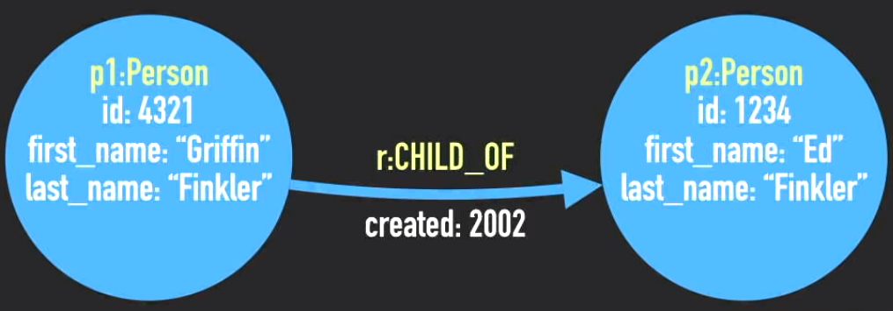
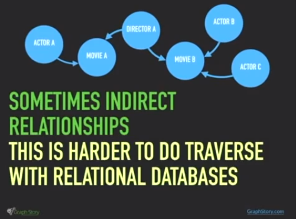

# GRAPH + RELATIONAL DATABASES
- https://www.youtube.com/watch?v=GekQqFZm7mA

## Relational Databases
- a ledger style structure
- a **THING** is a **row** in a **table**
- sometimes you split up the **THING** into parts across different **tables**

#### relationships are made(setup) with Constraints

- the you use Foreign Key **CONSTRAINTS** to represent **relationships** between data
	- by writing foreign keys, you give a row in some table an equal (or whatever) relationship to another row in the table (or another table)
		- e.g. if you put a value in this column over here in this table and there isn't a corresponding value in this table over here, then it won't work.
		- e.g. you may not be able to delete something here (in this row) because something is attached to it.
- is rigid, limits the kinds of things you are allowed to put into the database
- can get complex (and rigid) when representing relationships
	- relationships in the real world
		- e.g. multilevel joins are terribly slow
	- ORMs (Object Relational Mapping) is used to create complex queries
- RDBMS are designed to answer **known questions**.

## Graph Databases
### \[property\] graphs
- a **THING** is a **node** or **vertex**
- **nodes** have **PROPERTIES**
	- usually key-value pairs {Keys: Values}
- **nodes** also have **LABELS** to tell you what type of thing it is
- example of a node:

	n : Person
	id : 1234
	first_name : "Ed"
	last_name : "Finkler"
	
	where

	n is the node label
	other stuff are properties
- **nodes** are connected together by **RELATIONSHIPS** or **EDGES**
- **RELATIONSHIPS** have a **type** and a **direction** and can have **properties**

- __above__: setup of two nodes, both of them of type **person**
	- they both have similar properties, **but they don't have to**
	- there is a **directional** relationship between them (CHILD_OF)

#### in summary it's just **DOTS/NODES** and **LINES/EDGES** all the way down

- it more powerful than RDBMS specifically because **the meaning is in the relationships**
	- direct relationships (but that's not hard to do with RDBMS)
	- indirect relationships (which are harder to traverse with relational databases)
	
	- questions you didn't expect (when designing the database, which is almost always)

TO BE CONTINUED : https://youtu.be/GekQqFZm7mA?t=11m40s