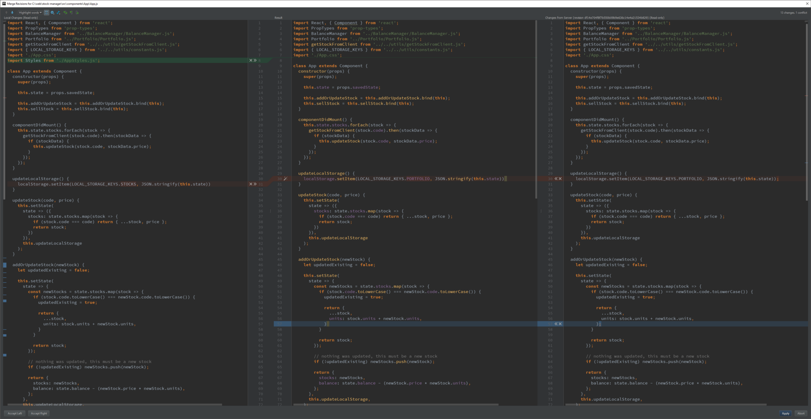

# GIT

## **a happy git relationship**
At a high level it’s pretty simple: align the way you work with the way Git works.
- In your task management system, create smallish tasks that will be completed by a single developer
- For each task, complete the work in a single branch
- When you’re done with the task, merge your branch as a single commit

## **useful reads**
git best practises ref
- https://hackernoon.com/my-approach-to-using-git-without-the-headaches-6926df5af0c7
example
- https://raw.githubusercontent.com/altercation/solarized/master/README.md

## **most frequent commands**
	git init
	git add .
	git commit -m “message here”
	git push origin master

## **to connect this local git to a new empty remote repository**
- https://gist.github.com/mindplace/b4b094157d7a3be6afd2c96370d39fad
- go to github and make new repository, then copy the .git web address
	
	git remote add origin [copied web address]

## **to check where this git will connect to**
	git remote -v

## **images**
- https://stackoverflow.com/questions/14494747/add-images-to-readme-md-on-github
- https://help.github.com/articles/about-readmes/
```
If you use Markdown (README.md):
Provided that you have the image in your repo, you can use a relative URL:

If you need to embed an image that's hosted elsewhere, you can use a full URL

GitHub recommend that you use relative links with the ?raw=true parameter to ensure forked repos point correctly.
Check out an example: https://raw.github.com/altercation/solarized/master/README.md
Also, the documentation on relative links in README files: https://help.github.com/articles/relative-links-in-readmes
And of course the markdown docs: http://daringfireball.net/projects/markdown/syntax
Additionally, if you create a new branch screenshots to store the images you can avoid them being in the master working tree
You can then embed them using:

```

## **commenting**
- https://stackoverflow.com/questions/4823468/comments-in-markdown
- https://talk.commonmark.org/t/method-for-comments-especially-multiline/208/3

## **starting new git repo**

	Initialize
	1. make empty folder mkdir thatriectoryname 
	2. cd thatdirectoryname
	3. git init  # initializes (makes a git repo object from git blueprint)
	4. make file and put it there

	Unstaged
	1. the file is called ‘unstaged’, meaning git doesn’t know anything about it
	    1. ‘working changes’
	    2. git is not protecting this file
	
	Staged
	1. when we have done enough to the file and want to commit, we ‘stage’ the file
	    1. it means taking things from the ‘unstaged’ box and putting it into the ‘staged’ box
	    2. can put many different files into the ‘staged’ box (i guess it just means grouping relevant files together before sending it somewhere)
	2. to stage, use git add filename.txt
	3. it is now somewhere in the staged box!
	
	Commited
	1. when ready, use git commit -m “message here”
	2. commit means that file will now forever live in git’s history, which can be tracked and rewinded to.
	3. by default git creates a master branch, use git branch to check
	4. use git log to see what the “commit” box currently has

## **git push to all remotes in the project (e.g. heroku and github)**
- https://stackoverflow.com/questions/5785549/able-to-push-to-all-git-remotes-with-the-one-command
- add shortcut to git cli
	git config --global alias.pushall '!git remote | xargs -L1 git push --all'
- then just use shortcut
	git pushall

## **be careful when moving and renaming**
- Git doesn’t track moved/renamed files. However, if it sees your branch has a removed file, and a new file, and they are, say, 90% similar, it will assume that it’s seeing a renamed file.

## **merge conflicts**
- https://hackernoon.com/my-approach-to-using-git-without-the-headaches-6926df5af0c7
- using WebStorm

<p align="center">One added line (green), one edited line (blue) and a conflict (red)</p>

## **solving clashes and local/remote changes**
- https://stackoverflow.com/questions/22620393/various-ways-to-remove-local-git-changes
	
	/*Solution : Major Edit(s): 03/26 : * Replaced many of vague terms with git specific terminology [tracked/untracked/staged/unstaged]
	There could be only three categories of files when we make local changes:
	Type 1. Staged Tracked files
	Type 2. Unstaged Tracked files
	Type 3. Unstaged UnTracked files a.k.a UnTracked files
	/* Staged - Those that are moved to staging area/ Added to index
	/* Tracked - modified files
	/* UnTracked - new files. Always unstaged. If staged, that means they are tracked.
	What each commands do:
	1. git checkout . - Removes Unstaged Tracked files ONLY [Type 2]
	2. git clean -f - Removes Unstaged UnTracked files ONLY [Type 3]
	3. git reset --hard - Removes Staged Tracked and UnStaged Tracked files ONLY[Type 1, Type 2]
	4. git stash -u - Removes all changes [Type 1, Type 2, Type 3]
	Conclusion:
	It's clear that we can use either
	(1) combination of `git clean -f` and `git reset --hard` 

	OR
	(2) `git stash -u`

	to achieve the desired result.
	Note: Stashing, as the word means 'Store (something) safely and secretly in a specified place.' This can always be retrieved using git stash pop. So choosing between the above two options is developer's call.
	Thank you Christoph and Frederik Schøning.
	Edit: 03/27
	I thought it's worth putting the 'beware' note to git clean -f
	git clean -f
	There is no going back. Use -n or --dry-run to preview the damage you'll do.
	If you want to also remove directories, run git clean -f -d
	If you just want to remove ignored files, run git clean -f -X
	If you want to remove ignored as well as non-ignored files, run git clean -f -x
	reference : more on git clean : How to remove local (untracked) files from the current Git working tree?
	Edit: 05/20/15
	Discarding all local commits on this branch [Removing local commits]
	In order to discard all local commits on this branch, to make the local branch identical to the "upstream" of this branch, simply run git reset --hard @{u}
	Reference: http://sethrobertson.github.io/GitFixUm/fixup.html
	or do git reset --hard origin/master [if local branch is master]
	Note: 06/12/2015 This is not a duplicate of the other SO question that's marked as duplicate. This question address how to remove local GIT changes [remove a file added, remove changes added to existing file etc and the various approaches; Where in the other SO thread only address how to remove local commit. If you added a file, and you want to remove that alone, then the other SO thread doesn't discuss about it. Hence this is not a duplicate of the other one]
	Edit: 06/23/15
	How to revert a commit already pushed to a remote repository?
	$ git revert ab12cd15

	Edit: 09/01/2015
	Delete a previous commit from local branch and remote branch
	Case: You just commited a change to your local branch and immediately pushed to the remote branch, Suddenly realized , Oh no! I dont need this change. Now do what?
	git reset --hard HEAD~1 [for deleting that commit from local branch]
	git push origin HEAD --force [both the commands must be executed. For deleting from remote branch]
	Whats the branch ? Its the currently checked out branch.
	Edit 09/08/2015 - Remove local git merge:
	I am on master branch and merged master branch with a newly working branch phase2
	$ git status
	# On branch master

	$ git merge phase2

	$ git status
	# On branch master
	# Your branch is ahead of 'origin/master' by 8 commits.

	Q: How to get rid of this merge? Tried git reset --hard and git clean -d -f Both didn't work.
	The only thing that worked are any of the below ones:
	$ git reset --hard origin/master

	or
	$ git reset --hard HEAD~8

	or
	$ git reset --hard 9a88396f51e2a068bb7 [sha commit code - this is the one that was present before all your merge commits happened]