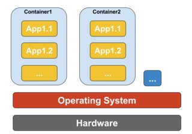
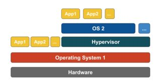
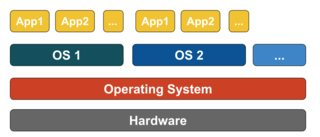

# DOCKER

#### Docker is like Git for OSes
- in Git, you start with a base image(repo) with git init. your repo is .git
- in Docker, you start a container, and you can freeze and save different container settings

## TLDR
### what is a container
- docker is a popular one. there are others
- container is like a virtual OS on a machine. but lighter, because its a bunch of processes in a namespace.
- **containers are a bunch of processes grouped together in a namespace**
- if you can group all the required processes and record them, you can tell another computer to run the same processes to get the exact same environment to run your app on
- that other computer can be anywhere: on your friend's laptop, on the cloud, in google's servers.

## TODO: do stuff with docker
- https://towardsdatascience.com/beginners-guide-to-data-science-python-docker-3181fd321a5c
- https://towardsdatascience.com/how-docker-can-help-you-become-a-more-effective-data-scientist-7fc048ef91d5

## Docker / Virtual Machines

> processes grouped in their own namespace = **container** [link](https://stackoverflow.com/questions/16047306/how-is-docker-different-from-a-normal-virtual-machine)

#### Docker is an app for your apps to run

- it manages setting up everything needed to run your app
- it runs on its own OS (your laptop or the cloud)
- your apps are called **containers**
- you can run code in your apps, or you can run code in other people's apps
	- python + tf + linux (docker image)
- you can *actually* also containerize a 'system' (OS image minus the base OS, like Git, an OS branch from the Windows repo)

#### Virtual Machines is OS simulation
- they are kungfu at CPU level to make the Virtual OS think it has the same resources as the Host OS
- two ways:

1. Emulation
	- writing a program that simulates all the underlying physical hardware
	- e.g. Parallels, VMware Player, VirtualBox, QEMU
	- slow

2. Hypervisors (Virtual Machine Monitor)
	- run Guest OS directly on CPU
	- e.g. Xen, KVM
	- instruction sets (CPU code) for both OSes must be the same
	- as fast as original OS
- works by intercepting all calls made by Virtual OS to 
- they are defined as an ***abstraction of physical hardware*** so its also a super general term

## The Lower Level
- https://stackoverflow.com/questions/16047306/how-is-docker-different-from-a-normal-virtual-machine
	It might be helpful to understand how virtualization and containers work at low level. That will clear up lot of things.

	Note: I'm simplifying a bit in describing below. See references for more information.

	How virtualization works at low level?

		In this case VM manager takes over the CPU ring 0 (or the "root mode" in newer CPUs) and intercepts all privileged calls made by guest OS to create illusion that guest OS has its own hardware. Fun fact: Before 1998 it was thought to be impossible to achieve this in x86 architecture because there was no way to do this kind of interception. The folks at VMWare were the first who had an idea to rewrite the executable bytes in memory for privileged calls of guest OS to achieve this.

		The net effect is that virtualization allows you to run two completely different OS on same hardware. Each guest OS goes through all the process of bootstrapping, loading kernel etc. You can have very tight security, for example, guest OS can't get full access to host OS or other guests and mess things up.

	How containers works at low level?

		Around 2006, people including some of the employees at Google implemented new kernel level feature called namespaces (however the idea long before existed in FreeBSD). One function of the OS is to allow sharing of global resources like network and disk to processes. What if these global resources were wrapped in namespaces so that they are visible only to those processes that run in the same namespace? Say, you can get a chunk of disk and put that in namespace X and then processes running in namespace Y can't see or access it. Similarly, processes in namespace X can't access anything in memory that is allocated to namespace Y. Of course, processes in X can't see or talk to processes in namespace Y. This provides kind of virtualization and isolation for global resources. This is how docker works: Each container runs in its own namespace but uses exactly the same kernel as all other containers. The isolation happens because kernel knows the namespace that was assigned to the process and during API calls it makes sure that process can only access resources in its own namespace.

		The limitations of containers vs VM should be obvious now: You can't run completely different OS in containers like in VMs. However you can run different distros of Linux because they do share the same kernel. The isolation level is not as strong as in VM. In fact, there was a way for "guest" container to take over host in early implementations. Also you can see that when you load new container, the entire new copy of OS doesn't start like it does in VM. All containers share same kernel. This is why containers are light weight. Also unlike VM, you don't have to pre-allocate significant chunk of memory to containers because we are not running new copy of OS. This enables to run thousands of containers on one OS while sandboxing them which might not be possible to do if we were running separate copy of OS in its own VM.

## Docker vs Virtual Machines (VM)
- https://stackoverflow.com/questions/29096967/what-are-the-differences-between-a-vm-image-and-a-docker-image?noredirect=1&lq=1
- https://stackoverflow.com/questions/16047306/how-is-docker-different-from-a-normal-virtual-machine

	These are some differences between a docker and a VM image which I could list out:

	1. Snapshot process is faster in Docker than VMs

	We generally start with a base image, and then make our changes, and commit those changes using docker, and it creates an image. This image contains only the differences from the base. When we want to run our image, we also need the base, and it layers our image on top of the base using a layered file system. File system merges the different layers together and we get what we want, and we just need to run it. Since docker typically builds on top of ready-made images from a registry, we rarely have to "snapshot" the whole OS ourself. This ability of Dockers to snapshot the OS into a common image also makes it easy to deploy on other docker hosts.

	2. Startup time is less for Docker than VMs

	A virtual machine usually takes minutes to start, but containers takes seconds, and sometime even less than a second.

	4. Docker images have more portability

	Docker images are composed of layers. When we pull or transfer an image, only the layers we haven’t yet in cache are retrieved. That means that if we use multiple images based on the same base Operating System, the base layer is created or retrieved only once. VM images doesn't have this flexibility.

	5. Docker provides versioning of images

	We can use the docker commit command. We can specify two flags: -m and -a. The -m flag allows us to specify a commit message, much like we would with a commit on a version control system:

	$ sudo docker commit -m "Added json gem" -a "Kate Smith"
	0b2616b0e5a8 ouruser/sinatra:v2
	4f177bd27a9ff0f6dc2a830403925b5360bfe0b93d476f7fc3231110e7f71b1c
	6. Docker images do not have states

	In Docker terminology, a read-only Layer is called an image. An image never changes. Since Docker uses a Union File System, the processes think the whole file system is mounted read-write. But all the changes go to the top-most writeable layer, and underneath, the original file in the read-only image is unchanged. Since images don't change, images do not have state.

	7. VMs are hardware-centric and docker containers are application-centric

	Let's say we have a container image that is 1GB in size. If we wanted to use a Full VM, we would need to have 1GB times x number of VMs you want. In docker container we can share the bulk of the 1GB and if you have 1000 containers we still might only have a little over 1GB of space for the containers OS, assuming they are all running the same OS image.

	8. Supported image formats

	Docker images:

	bare. The image does not have a container or metadata envelope.
	ovf. The OVF container format.
	aki. An Amazon kernel image.
	ari. An Amazon ramdisk image.
	ami. An Amazon machine image.
	VM images:

	raw. An unstructured disk image format; if you have a file without an extension it is possibly a raw format
	vhd. The VHD disk format, a common disk format used by virtual machine monitors from VMware, Xen, Microsoft, VirtualBox, and others
	vmdk. Common disk format supported by many common virtual machine monitors
	vdi. Supported by VirtualBox virtual machine monitor and the QEMU emulator
	iso. An archive format for the data contents of an optical disc, such as CD-ROM.
	qcow2. Supported by the QEMU emulator that can expand dynamically and supports Copy on Write
	aki. An Amazon kernel image.
	ari. An Amazon ramdisk image.
	ami. An Amazon machine image.

## Docker vs a deploying to a consistent production environment
- https://stackoverflow.com/questions/16047306/how-is-docker-different-from-a-normal-virtual-machine

	In relation to:-

	"Why is deploying software to a docker image easier than simply deploying to a consistent production environment ?"
	Most software is deployed to many environments, typically a minimum of three of the following:

	Individual developer PC(s)
	Shared developer environment
	Individual tester PC(s)
	Shared test environment
	QA environment
	UAT environment
	Load / performance testing
	Live staging
	Production
	Archive
	There are also the following factors to consider:

	Developers, and indeed testers, will all have either subtlely or vastly different PC configurations, by the very nature of the job
	Developers can often develop on PCs beyond the control of corporate or business standardisation rules (e.g. freelancers who develop on their own machines (often remotely) or contributors to open source projects who are not 'employed' or 'contracted' to configure their PCs a certain way)
	Some environments will consist of a fixed number of multiple machines in a load balanced configuration
	Many production environments will have cloud-based servers dynamically (or 'elastically') created and destroyed depending on traffic levels
	As you can see the extrapolated total number of servers for an organisation is rarely in single figures, is very often in triple figures and can easily be significantly higher still.

	This all means that creating consistent environments in the first place is hard enough just because of sheer volume (even in a green field scenario), but keeping them consistent is all but impossible given the high number of servers, addition of new servers (dynamically or manually), automatic updates from o/s vendors, anti-virus vendors, browser vendors and the like, manual software installs or configuration changes performed by developers or server technicians, etc. Let me repeat that - it's virtually (no pun intended) impossible to keep environments consistent (okay, for the purist, it can be done, but it involves a huge amount of time, effort and discipline, which is precisely why VMs and containers (e.g. Docker) were devised in the first place).

	So think of your question more like this "Given the extreme difficulty of keeping all environments consistent, is it easier to deploying software to a docker image, even when taking the learning curve into account ?". I think you'll find the answer will invariably be "yes" - but there's only one way to find out, post this new question on Stack Overflow.