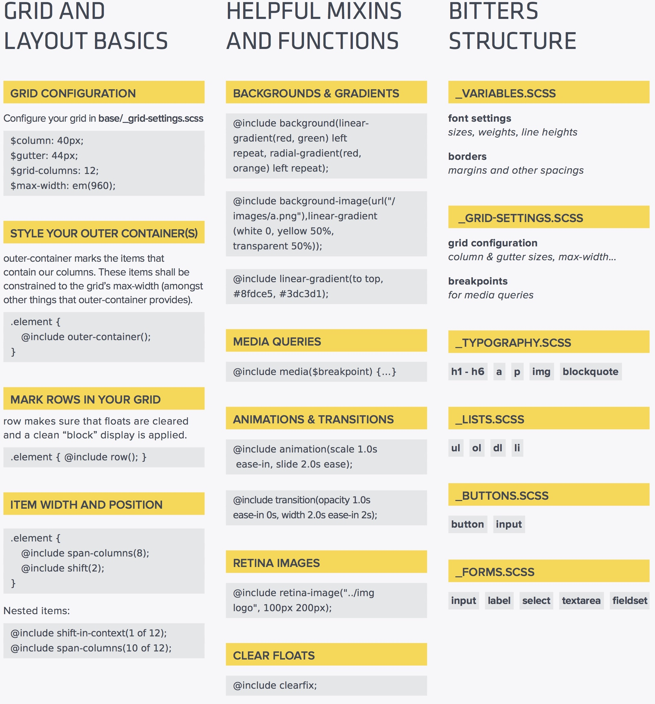
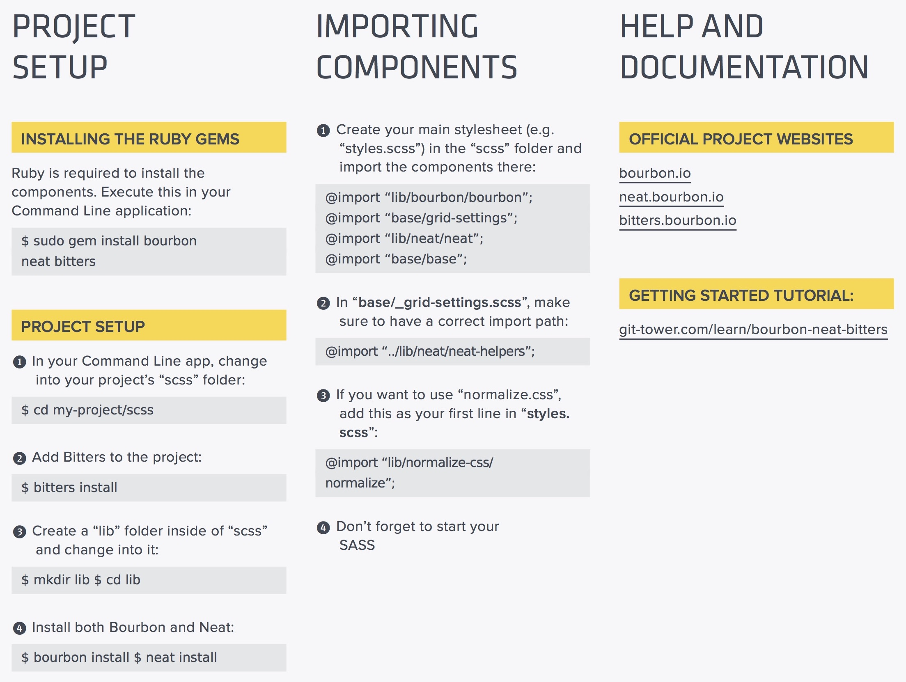

# SASS / SCSS

## TODO: css animations and pseudo-classes!
- [dropdown menu](https://medialoot.com/blog/how-to-create-a-responsive-navigation-menu-using-only-css/)
- [deconstruct some animations](http://freefrontend.com/css-menu/)
- [pseudo classes](https://css-tricks.com/pseudo-class-selectors/) [source2](https://www.smashingmagazine.com/2016/05/an-ultimate-guide-to-css-pseudo-classes-and-pseudo-elements/) [source3](https://htmldog.com/guides/css/intermediate/pseudoclasses/)

## architecture of CSS (for large scale maintainability)
- https://sass-guidelin.es/#architecture
- https://smacss.com

## tutorials!
- https://medium.com/@thejasonfile/getting-started-with-sass-dedb271bdf5a
- https://tutorialzine.com/2016/01/learn-sass-in-15-minutes
- https://scotch.io/tutorials/getting-started-with-sass
- https://sass-lang.com/guide

## watch a scss file (autocompile into css)
> sass --watch input_file.scss:output_file.css

### variables
- store colors, font stacks, or any css value you think you want to reuse
- use $ to turn it into a variable

```css
$font-stack: Helvetica, sans-serif;

$primary-color: #333;

body {
	font: 100% $font-stack;
	color: $primary-color;
}
```

### shorthand in css
- https://www.webcredible.com/blog/css-shorthand-properties/

## sass has FUNCTIONS
- http://sass-lang.com/documentation/Sass/Script/Functions.html

### how to perform vertical centering
- [decision tree on which ones to use](https://css-tricks.com/centering-css-complete-guide/)

### other tips and tricks (css)
- [vignettes](http://nimbupani.com/vignettes-with-css3-box-shadows.html)

## bourbon neat and bitters (library, library, scaffold/project template)



