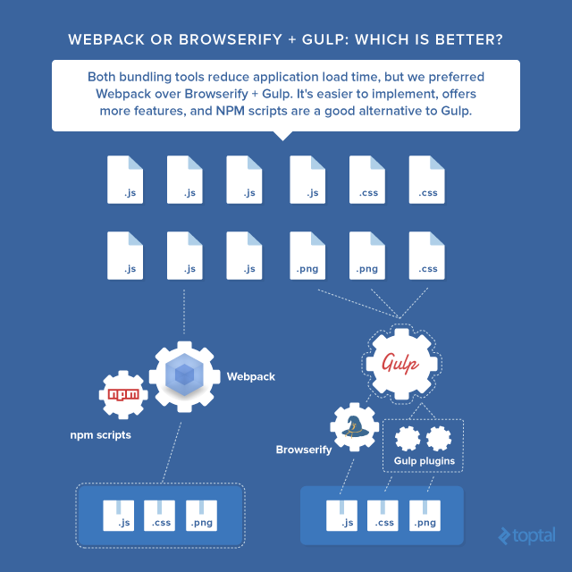

# BUILD TOOLS
||| future

- https://www.toptal.com/front-end/webpack-browserify-gulp-which-is-better
- https://tooling.github.io/book-of-modern-frontend-tooling/dependency-management/webpack/introduction.html

## what are they
- things that bundle your messy files together into a big file that makes it faster to run your webpage and stuff
- automating non-core-logic tasks
- many other things to maintain large modern frontend things
