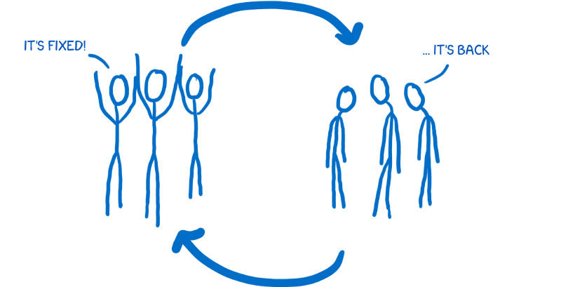

# REDUX

## TODO: tutorial
- http://www.gistia.com/beginners-guide-redux/
- https://code-cartoons.com/a-cartoon-guide-to-flux-6157355ab207
- https://code-cartoons.com/a-cartoon-intro-to-redux-3afb775501a6

## [flux / redux : what are they?](https://www.reddit.com/r/reactjs/comments/3v5klh/eli5_what_are_flux_and_redux_and_how_are_the_two/)
- flux is a 'concept' that facebook came up with for how to build applications with **React**
	- it is a frame-of-mind on how to handle things
- **redux** is the most popular and accepted variation on **flux**

## first, what is flux?
[taken from medium post](https://code-cartoons.com/a-cartoon-guide-to-flux-6157355ab207)

> flux is a pattern for handling data in your application

- flux and react grew up together on facebook
- they were developed to address a set of problems that fb keeps seeing

### the problem: facebook notification bug

	

		

			
			

				when you log into facebook, you see a notification.
				when you click on it, there are no new messages.
				the notification goes away.
				after a while, it comes back.
				repeat.
			

		

	

	

		

			
			

				it wasn't just a cycle for the users, it was also for the dev team.
				fix bug > fine > bug comes back > fix bug > fine > bug comes back
			

		

	

facebook wanted to get out of this cycle, by making the **system predictable** so that this problem would keep resurfacing.

### the underlying problem: the way the data flowed through the application

TO BE CONTINUED https://code-cartoons.com/a-cartoon-guide-to-flux-6157355ab207