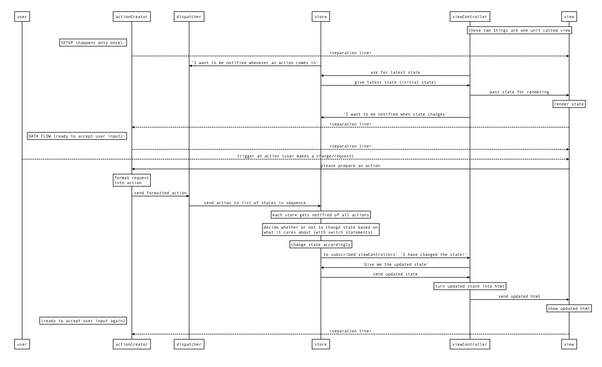

# FLUX
||| ref

## link
- https://hackernoon.com/a-basic-react-redux-introductory-tutorial-adcc681eeb5e

## before you get to react, know redux
### before you get to redux, know flux
#### this is about flux

## flux
- solves the messy interactions from using the MVC model
- because some actions would trigger a cascade of other actions
- and because JS is async, many actions in async can trigger cascades of many other actions (hence they are very hard to track)
- MVC+
- flux as the solution: unidirectional information flow
    1. action
    2. dispatcher
    3. store
    4. view
    5. goes back to 1.

## describing flux as a team of people working together
### 1. the ACTION creator
#### takes input, turns it into actions, passes it to dispatcher
- in charge of creating actions
    - the path that all changes and interactions go through
- like a cartographer, mapping out routes
- or a telegraph operator
    1. tell the operator what you want to send
    2. the operator formats it so that the rest of the system can understand (dots and dashes)
- creates an action with a type and a payload
    - type: one of the types you have defined as actions (usually a list of constants)
        - e.g. MESSAGE_CREATE
- after creating the action, the action creator passes the action off to the dispatcher

> There’s a neat side effect to having a part of your system that knows all of the possible actions. A new developer can come on the project, open up the action creator files and see the entire API — all of the possible state changes — that your system provides.

### 2. the DISPATCHER
#### takes an action, passes it to all the stores registered to it, handles dependencies (pass to store 1, wait for result, then pass to store 2)
#### controls when to tell which store to do what
- basically a big registry of callbacks
- like a telephone switchboard operator
    - keeps a list of all the stores(?) it needs to send actions to
    - when the action comes in, it will pass the action around to different stores
    - does this asynchronously, like a multi-tasking switchboard operator at the peak of his/her career
    - dependencies between stores (do 1 before doing 2) are managed with waitFor(), which is like async/await
- different from many other architectures:
    - action is sent to all registered stores regardless of action type
    - the telephone operator sends a full list of actions to all stores
    - means the stores do the filtering for what it cares about what doesn't

### 3. the STORE
#### go through all actions taken from DISPATCHER, make changes to state based on what it cares about, and tell CONTROLLER VIEW that the state has changed
#### only does stuff that they care about, in their own time
- the store holds all state in the application (snapshot of the current state of the app)
- all the state changing logic happens inside the stores
- like an over-controlling bureaucrat
    - all state changes must be made by it personally
    - all requests for changes must go through the action creator > dispatcher pipeline, you can't request the store to change stuff directly
- if a store is registered with the dispatcher, all actions will be sent to it
- inside the store there's usually a switch statement to look at the action type and decide whether or not to care about the action.
- if the store cares about the action, it will figure out what change needs to be made based on this action, and update the state.
- once the store has made its changes, it will emit a **change event**
- this will notify the controller view (?) that the state has changed.

### 4. the CONTROLLER VIEW and the VIEW
#### controller view is the logic, view is the display endpoint
#### when the state has changed, take new state, turn state into html and pass it to the views.
- only knows how to take the data and format into output that people understand (HTML)
- the controller view is like the middle manager between store and view
    - store tells CONTROLLER VIEW when the state has changed, CONTROLLER VIEW collects the new state, formats state into html, passes the updated state to all of the VIEWs under it

## HOW THEY ALL WORK TOGETHER (in flowchart)

