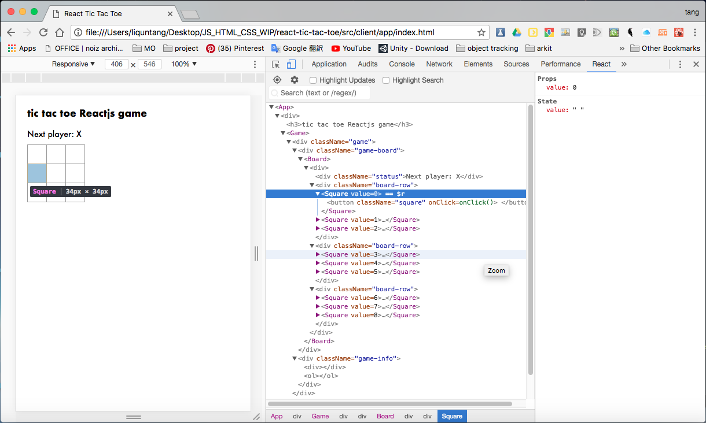

# REACTjs
- another framework like node

## REACT, FLUX, REDUX, REACT-REDUX
- REACT = framework
- [FLUX](./flux-readme.md) = architecture for REACT
- [REDUX](./redux-readme.md) = different architecture
- REACT-REDUX = REACT framework with REDUX architecture

## TODO: react apps
- todo app (quick) https://medium.freecodecamp.org/how-to-build-a-real-time-todo-app-with-react-native-19a1ce15b0b3
- learning webpack with react https://github.com/MikaelCarpenter/ReactWebpack

## the babel for reactjs
- https://www.codementor.io/tamizhvendan/beginner-guide-setup-reactjs-environment-npm-babel-6-webpack-du107r9zr

## the Travis CI for reactjs
- https://medium.com/@bezgachev/6-simple-steps-to-automatically-test-and-deploy-your-javascript-app-to-github-pages-c4c32a34bcb1

## props and state (two most important things to know in react)
- http://lucybain.com/blog/2016/react-state-vs-pros/

## DONE
- [react + sass menu](https://codepen.io/panzerstadt/pen/rdONWV?editors=0010)

## what is ReactJS
- a workflow for building apps by thinking of all code as components
- react code, esp. jsx, is **pre-compiled javascript**. needs a compiler
- generally needs `webpack` and `babel` to make it easy to compile into the max-compatibility version of Javascript
- use JSX to more easily work with html code
- easily work with different parts of code by using `this.props` and `this.state`
- two main libraries, `react` and `react-dom` installable from `npm`
- **components** use `PascalCase` (e.g. `class MyComponent extends React.Component(){ /*your component code here */ }`)
- `PascalCase` = (`camelCase` but with first character capitalized)
- **events** use `camelCase` (e.g. `onClick={()=> do_something}`)
- conventional in React apps to use `on*` names for the attributes and 
- `handle*` for the handler methods.
- It’s **strongly recommended** that you assign proper **keys** whenever you build dynamic lists. [Why?](https://reactjs.org/tutorial/tutorial.html#keys)
	- Component keys don’t need to be globally unique, only unique relative to the immediate siblings.


#### make a component
- component names convention: PascelCase (like camelCase, but starts with Capitalization)
```
import React from 'react'; // npm install react react-dom

class MyComponent extends React.Component {
	/* your component stuff goes here, usually ends with, or consists only of, render(){} */
	
	// single line render (no brackets)
	render(){
		return <p>Hello World!</p> 
	}

	// multiline render (with brackets)
	render(){
		return (
			<p>Hello World!</p>
			<p>This is multiline!</p>
			);
	}
}
```

##### two ways to make a component
class way, the standard way
- allows creation of state (like python's class, has state that can change)
```
// standard way
class Square extends React.Component {

    render(){
        return (
            <button className="square" onClick={() => 
            this.props.onClick()}>
                {this.props.value}
            </button>
        );
    }
}
```

simple way
- for components that only do render() and nothing else
- doesn't keep state
- components that are controlled by a parent component where the state of this component is stored in the parent component [read](https://reactjs.org/tutorial/tutorial.html#functional-components)
```
//simpler syntax called 'functional components'
// used for components that only have a 'render' method
function Square(props) {
    return (
        <button className="square" onClick={props.onClick}>
        {props.value}
        </button>
    );
}
```

#### this.props
- properties of the component
- is inferred (if it exists, grab it. if not, ignore)

```
class ButtonComponent extends React.Component {
	return(
		<button>
		{this.props.name}
		</button>
		);
}
```

then used in another component with

`<ButtonComponent value=2>`

#### constructors
- a constructor is used to initialize the state (the `this.state`)

looks like this
```
constructor(props){
	super(props);
	this.state= {
		value: null
	};
}
```

what's super(props) ? [read this](https://developer.mozilla.org/en-US/docs/Web/JavaScript/Reference/Classes#Super_class_calls_with_super)

> In JavaScript classes, you need to explicitly call super(); when defining the constructor of a subclass.

#### states (RAM for the component)
- can set state with this.setState({someValueKey: '3'})


#### React Devtools (to see what's going on and see props and state for everything)


#### where to best store state and props data (if interaction outside of component needed)
```
When you want to aggregate data from multiple children or to have two child components communicate with each other, move the state upwards so that it lives in the parent component. The parent can then pass the state back down to the children via props, so that the child components are always in sync with each other and with the parent.
```
- https://reactjs.org/tutorial/tutorial.html#lifting-state-up


## facebook's react app creator (like cookiecuter template)
- https://github.com/facebook/create-react-app/tree/master

## React did some changes to Javascript
### the heart of Javascript - DOM
- https://www.codecademy.com/articles/react-virtual-dom
- manipulating DOM is slow. most Javascript frameworks also UPDATE THEM MORE THAN THEY NEED TO
	- checklist app
		- when you tick one item, javascript rebuilds the ENTIRE list
- therefore React popularized something called *virtual DOM*

#### Virtual DOM
- [more](http://reactkungfu.com/2015/10/the-difference-between-virtual-dom-and-dom/)
- in React, for every DOM object, there is a corresponding *virtual DOM object*. a virtual DOM object is a ***representation*** of a DOM object (a lightweight copy)
- exactly same as DOM, but can't change anything on the screen
- manipulating virtual DOM is much faster, like editing a blueprint, vs moving rooms in the entire house (DOM).
- when a JSX element is rendered, *every single virtual DOM* gets updated, then **React compares the virtual DOM with the previuos virtual DOM**, like Git, and **only updates the changes**.
- it is called **diffing**

> Programming in React means constantly working with event listeners


## Event Listeners
- onClick, onMouseOver and etc
- [full list](https://reactjs.org/docs/events.html#supported-events)
- when you feed an event listener, its attribute must be a function (without brackets it seems)
- `` is valid


## JSX is not compulsory to write React
	You can write React code without using JSX at all!

	The majority of React programmers do use JSX, and we will use it for the remainder of this tutorial, but you should understand that it is possible to write React code without it.

	The following JSX expression:

	const h1 = <h1>Hello world</h1>;
	can be rewritten without JSX, like this:

	const h1 = React.createElement(
	  "h1",
	  null,
	  "Hello, world"
	);
	When a JSX element is compiled, the compiler transforms the JSX element into the method that you see above: React.createElement(). Every JSX element is secretly a call to React.createElement().

	We won't go in-depth into how React.createElement() works, but you can start with the documentation if you'd like to learn more!


## export default ComponentName, what is that?
- https://stackoverflow.com/questions/31852933/why-es6-react-component-works-only-with-export-default

### why export default ?
- uses React convention, in that you can only export **ONE** component out of your single jsx file
- if you don't use default, like `export ComponentName`, then you have to call the component name explicitly, using `import { ComponentName, AnotherComponentName } from 'myJSXFile.jsx';`. notice that you can export **MORE THAN ONE** component this way. but it is not recommended.
- if you use default, you are free to rename the components as whatever name you like.

#### A Basic Component
```JSX
// this file is saved as component1.jsx
class HelloWorldComponent extends React.Component {
	render() {
		<div>
			<p>Hello World!</p>
		</div>
	}
}

// option 1
export default HelloWorldComponent;

// option 2
export HelloWorldComponent;
// export AnotherComponent;  
//if you don't follow convention and write another component in this file
// you can still export them
```

#### then in the main file:
```
// option 1 - renamable component
import Jollywag from 'component1.jsx';  //means you can rename your component

// option 2 - multiple, non-renamable components
import { HelloWorldComponent, AnotherComponent } from 'component1.jsx';

// option 3 - both default and specific names
// you can rename the default export, but can't rename the non-default one
import HelloRenamed, { AnotherComponent } from 'component1.jsx';
```

#### confusing? good. now follow the conventions.


## this error: Warning: Each child in an array or iterator should have a unique “key” prop. Check the render method of “Game”.

- [scroll up a bit from here](https://reactjs.org/tutorial/tutorial.html#keys)
