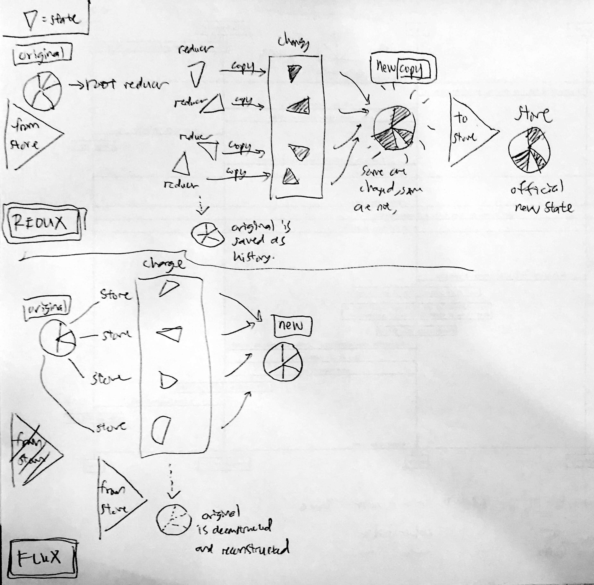

# REDUX
||| ref

## link
- [rahmat's recommendation](https://egghead.io/courses/getting-started-with-redux)
- https://code-cartoons.com/a-cartoon-intro-to-redux-3afb775501a6
- [conceptual diagram, connect(), and Provider](https://www.sohamkamani.com/blog/2017/03/31/react-redux-connect-explained/)
- [calling APIs](https://www.sohamkamani.com/blog/2016/06/05/redux-apis/)

## all you really need to write are reducers (to do things) and containers (to get things)!?
- https://www.codementor.io/vkarpov/beginner-s-guide-to-redux-middleware-du107uyud

## before you get to react, know redux
### before you get to redux, know flux
#### this is about redux

## redux
### problem: flux is almost perfect BUT
- Dan Abramov saw an opportunity to improve on flux
    - 'if you move a couple of things around, you could make better **dev tools** possible, with the same predictability as flux'
#### problem 1: the code for stores can't be reloaded without wiping out the state
- in order to change state, STORE has to do stuff to state, thereby replacing it with a new state (delete old state, replace with new state)
- in Flux, the store contains two things:
    1. the state change logic
    2. the current state itself
- having these two on the same object is a problem for hot reloading

> When you reload the store object to see the effect that the new state change logic has, you lose the state that the store is holding on to. Plus, you mess up the event subscriptions that tie the store to the rest of the system.

#### solution 1: separate store into two functions
- one object holds onto the state (doesn't get reloaded)
- another object contains all state change logic

#### problem 2: the state is being rewritten with every action
- in time travel debugging, you keep track of each version of a state object (like github, allowing rewinding)
- each time the state is changed, you need to add the old state to an array of previous state objects (history of changes list)
- because JS, adding variable to an array doesn't work (not a snapshot of the object, but a pointer. similar to python)
- to make it work, each version needs to be an entirely separate object (to prevent accidentally changing past versions)

#### solution 2: when action comes into store, copy state and make changes to the copy
- flux: action comes into store, state is changed by store.
- redux: action comes into store, state is copied, copied state is changed by store.

#### problem 3: there aren't good places for third-party plugins to jump in
- plugins should be drop-in without custom code
- for this to work, extension points are needed (places where code expects to have things added to it)

#### solution 3: make it easy to wrap parts of the system in other objects
- like all wrappers, add functionality non top of original
#### solution 3+: use a tree to structure the state change logic
- so that the store only emits one event to notify views that the state has changed.
- this event comes after the whole state tree has been processed(?)

#### other miscellaneous improvements
- reduce boilerplate
- easier to reuse logic in the store
- [others](https://stackoverflow.com/questions/32461229/why-use-redux-over-facebook-flux/32920459#32920459)

### solution: redux - flux + hot reloading + time travel debugging + misc
- flux+ (or flux with better devtooling)
    - hot reloading
    - time travel debugging
    - [others](https://stackoverflow.com/questions/32461229/why-use-redux-over-facebook-flux/32920459#32920459)

### redux as a better flux: unidirectional information flow
1. action (almost same as flux)
2. dispatcher (DOES NOT EXIST IN REDUX)
3. store (also does dispatching)
4. view (different structure)
5. view layer binding (new in REDUX)
6. goes back to 1.

7. ++: the root component (because it is React/Flux's root component with additional responsibilities)

## describing redux as a team of people working together, but a slightly different team compared to flux
### 1. the ACTION creator
#### FLUX: takes input, turns it into actions, passes it to dispatcher
#### REDUX: takes input, turns it into actinos, returns formatted action object

#### FLUX
- in charge of creating actions
    - the path that all changes and interactions go through
- like a cartographer, mapping out routes
- or a telegraph operator
    1. tell the operator what you want to send
    2. the operator formats it so that the rest of the system can understand (dots and dashes)
- creates an action with a type and a payload
    - type: one of the types you have defined as actions (usually a list of constants)
        - e.g. MESSAGE_CREATE

> There’s a neat side effect to having a part of your system that knows all of the possible actions. A new developer can come on the project, open up the action creator files and see the entire API — all of the possible state changes — that your system provides.

#### REDUX (changes)
- FLUX: after creating the action, the action creator passes the action off to the dispatcher
- REDUX: after creating the action, the action creator returns a formatted action object (no passing)


### 2. the DISPATCHER
#### takes an action, passes it to all the stores registered to it, handles dependencies (pass to store 1, wait for result, then pass to store 2)
#### controls when to tell which store to do what

#### FLUX
- basically a big registry of callbacks
- like a telephone switchboard operator
    - keeps a list of all the stores(?) it needs to send actions to
    - when the action comes in, it will pass the action around to different stores
    - does this asynchronously, like a multi-tasking switchboard operator at the peak of his/her career
    - dependencies between stores (do 1 before doing 2) are managed with waitFor(), which is like async/await
- different from many other architectures:
    - action is sent to all registered stores regardless of action type
    - the telephone operator sends a full list of actions to all stores
    - means the stores do the filtering for what it cares about what doesn't

#### REDUX : none
- DEAD (RIP)

### 3. the STORE
#### go through all actions taken from DISPATCHER, make changes to state based on what it cares about, and tell CONTROLLER VIEW that the state has changed
#### only does stuff that they care about, in their own time

#### FLUX : many stores
- the store holds all state in the application (snapshot of the current state of the app)
- all the state changing logic happens inside the stores
- like an over-controlling bureaucrat
    - all state changes must be made by it personally
    - all requests for changes must go through the action creator > dispatcher pipeline, you can't request the store to change stuff directly
- if a store is registered with the dispatcher, all actions will be sent to it
- inside the store there's usually a switch statement to look at the action type and decide whether or not to care about the action.
- if the store cares about the action, it will figure out what change needs to be made based on this action, and update the state.
- once the store has made its changes, it will emit a **change event**
- this will notify the controller view (?) that the state has changed.

#### REDUX: one store
- holds a state tree
- does dispatching (an independent entity previously in flux)
- delegates the work of figuring out what state changes need to happen (flux STORE's job) to the ROOT REDUCER which passes to REDUCERS

> Those actions will be then passed to the ALL of the reducers combined into our rootReducer and each one of them will return a new copy of the state modified (or not) according to the requested action.

```
STORE --passes current state--> ROOT REDUCER --passes to relevant reducers--> REDUCERS copy and make changes to copy --pass changed copy back--> ROOT REDUCER --passes new state back--> STORE that makes it the official new state
```

- FLUX: stores aren't necessarily connected to each other, flat structure
- REDUX: reducers are in a hierarchy, with as many levels as needed, just like component hierarchy




#### comment
- so in flux, the dispatcher's job of controlling who gets and does what is controlled by the store
- in redux, the store(dispatcher) controls the state tree, and the job of controlling who gets and does what is done by the store itself too, but the doing part is done by reducers


### 4. the CONTROLLER VIEW and the VIEW
#### controller view is the logic, view is the display endpoint
#### when the state has changed, take new state, turn state into html and pass it to the views.

#### FLUX : controller views and regular views
- only knows how to take the data and format into output that people understand (HTML)
- the controller view is like the middle manager between store and view
    - store tells CONTROLLER VIEW when the state has changed, CONTROLLER VIEW collects the new state, formats state into html, passes the updated state to all of the VIEWs under it

#### REDUX : smart and dumb components
##### dumb components == standard React component
##### smart components / containers == dumb components + connect()
- smart components (also called containers)
    - like controller views, but a few more rules
    - smart components are in charge of actions
    - if a dumb component under it needs to trigger an action, the smart component passes a function in via props. the dumb component can then treat that as a callback.
    - smart components do not have their own CSS styles
    - smart components rarely(?) emit DOM of their own (html). instead, they arrange dumb components, which lay out DOM elements (html).
- dumb components
    - do not depend directly on action files
        - because all actions are passed in via props
    - this means dumb components can be reused in a different app **that has different logic**.
    - they contain CSS styles that they need
        - can allow for custom styling, by accepting a style prop and merging it into the default styles
- when to use which?
    - when a component needs to know about a piece of the app state from the *ReduxStore*, then it is a smart component/container.


### 5. view layer binding
- for connecting the store with the views
- if you're using React, this is react-redux
- like the IT department for the view tree.
    - makes sure all the components can connect to the store
    - also takes care of a lot of technical details so that the rest of the hierarchy doesn't have to understand them (cogs in the machine, human or otherwise)

#### introduces 3 concepts
#### concept 1: the Provider component
- wrapped around the component tree(is it the state tree? more likely the root reducer and its reducers under it?). makes it easy for the root component's children to hook up to the store using connect().
#### concept 2: connect()
- connect(): a function provided by react-redux. if a component wants to get state updates, it wraps itself using connect().
    - the connect function will setup all the wiring for it, using the selector.
```
example :
ACTION CREATOR here takes new input and returns a formatted ACTION
then the VIEW LAYER BINDING takes the formatted ACTION and the
SMART COMPONENT (also CONTAINER) and plugs them together, so now the
SMART COMPONENT HAS THE ACTION.

the VIEW LAYER BINDING does this (with its connect() function):
connect(mapStateProps, mapDispatchProps)(ContactList)
- mapStateToProps
    - state = get state from store
- mapDispatchToProps
    - dispatch = trigger action, make action, change state of store
- ContactList
    - the component (that is going to become a SMART COMPONENT / CONTAINER)
```
#### concept 3: selector
- selector: a function you can write. specifies what parts of the state a component needs as properties.

### 7. the root component (in REACT and REACT-REDUX)
> ALL REACT APPLICATIONS HAVE ROOT COMPONENTS. IN REDUX APPLICATIONS, THIS COMPONENT TAKES ON MORE RESPONSIBILITY

- component at the top level of the component hierarchy (like github's first commit)
- its role is to put all the teams in place to tackle the work
    - creates the store
        - tells it which reducer to use
    - brings together the view layer binding and the views
- that's it. doesn't do much after the setup.


## HOW THEY ALL WORK TOGETHER (in flowchart)


