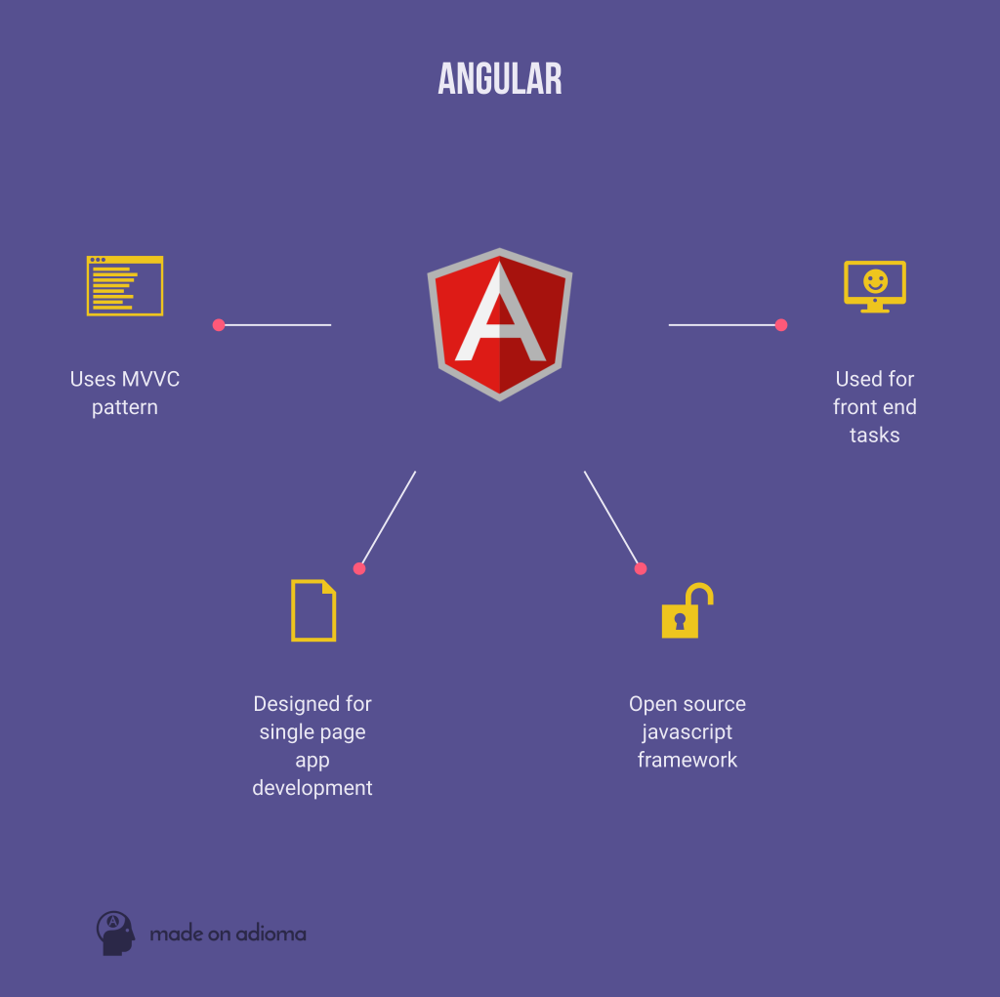
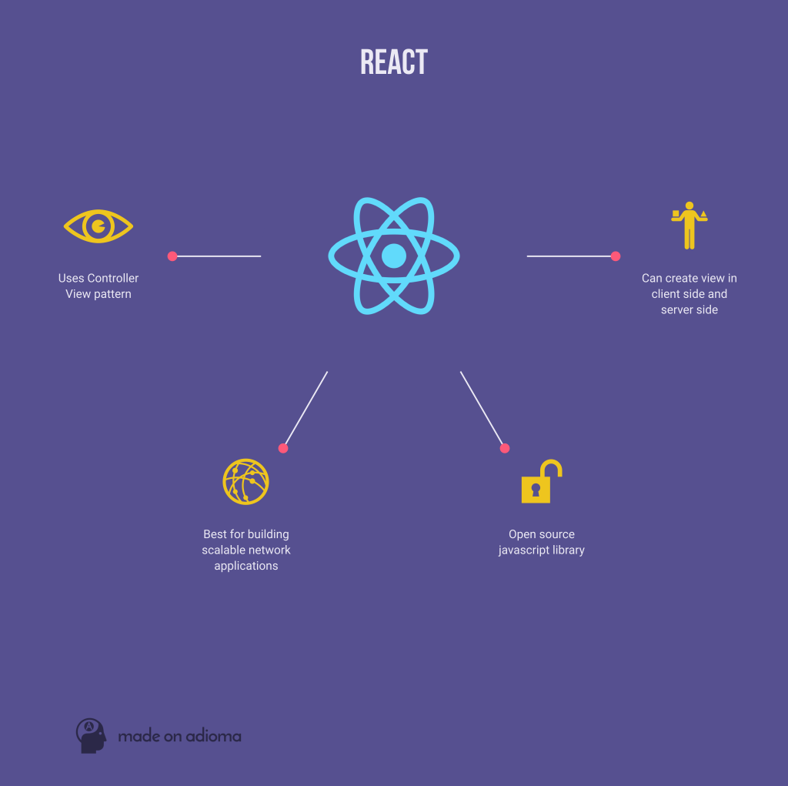
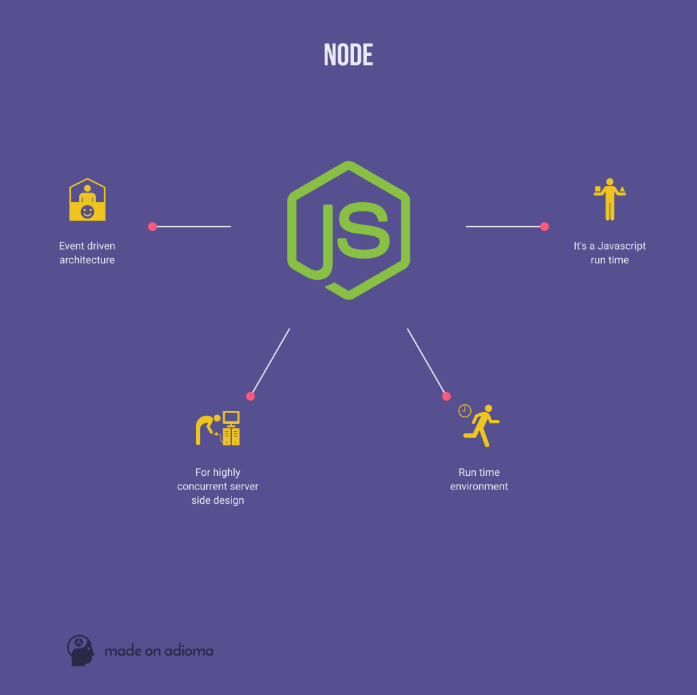

# Javascript Web Frameworks
||| Reference

Angular - React
- http://blog.liveedu.tv/angular-js-vs-react-js-vs-node-js-which-is-the-best/

## Angular Js
- similar to flask, designed for single page apps
- MVC pattern (Model-View-Controller)
	- model and view are automatically synced (called [two way bind](https://www.sitepoint.com/two-way-data-binding-angularjs/)), where view and model can affect the app's state.
- angular views are simple HTML pages, with Javascript doing the processing

## React Js
- similar perhaps to django (larger scale), designed for scalable network applications
- Controller View pattern
- high performance client and server side rendering with [one-way flow for data binding](https://trello.com/c/t87UKRyQ/78-what-are-two-way-data-binding-and-one-way-data-flow-and-how-are-they-different) (meaning only the model can change the app's state, *the client cannot*)
- highly reusable (modular) components
- small API, easy to pickup

### React Native
- allows Native apps in IOS

## Node Js
- event driven architecture
- high concurrency (Nginx like)
- simplified development of complex applications
- Javascript front and backend

