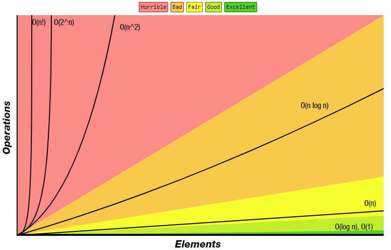

# Big O notation
### O means slOwness
- https://rob-bell.net/2009/06/a-beginners-guide-to-big-o-notation/
- https://en.wikipedia.org/wiki/Analysis_of_algorithms
- https://www.hackerearth.com/ja/practice/notes/big-o-explained/
- https://stackoverflow.com/questions/487258/what-is-a-plain-english-explanation-of-big-o-notation

## TODO: code examples of notations with timing
- python code examples of Big O [or even php examples (learn php along the way)](https://blog.eduonix.com/web-programming-tutorials/learn-about-big-o-notation-in-php/)
- https://www.khanacademy.org/computing/computer-science/algorithms/asymptotic-notation/a/big-o-notation
- [nice read](https://cathyatseneca.gitbooks.io/data-structures-and-algorithms/analysis/notations.html)

## [cheat sheet](https://en.wikipedia.org/wiki/Best,_worst_and_average_case) [(source2)](http://bigocheatsheet.com/)
1. [sorting](https://en.wikipedia.org/wiki/Sorting_algorithm#Comparison_of_algorithms)

<table class="wikitable">
<tbody>
	<tr>
		<th>Algorithm</th>
		<th>Data structure</th>
		<th>Time complexity:Best</th>
		<th>Time complexity:Average</th>
		<th>Time complexity:Worst</th>
		<th>Space complexity:Worst</th>
	</tr>

	<tr>
		<td>Quick sort</td>
		<td>Array</td>
		<td>O(<i>n</i> log(<i>n</i>))</td>
		<td>O(<i>n</i> log(<i>n</i>))</td>
		<td>O(<i>n</i><sup>2</sup>)</td>
		<td>O(n)</td>
	</tr>

	<tr>
		<td>Merge sort</td>
		<td>Array</td>
		<td>O(<i>n</i> log(<i>n</i>))</td>
		<td>O(<i>n</i> log(<i>n</i>))</td>
		<td>O(<i>n</i> log(<i>n</i>))</td>
		<td>O(n)</td>
	</tr>

	<tr>
		<td>Heap sort</td>
		<td>Array</td>
		<td>O(<i>n</i> log(<i>n</i>))</td>
		<td>O(<i>n</i> log(<i>n</i>))</td>
		<td>O(<i>n</i> log(<i>n</i>))</td>
		<td>O(1)</td>
	</tr>

	<tr>
		<td>Smooth sort</td>
		<td>Array</td>
		<td>O(<i>n</i>)</td>
		<td>O(<i>n</i> log(<i>n</i>))</td>
		<td>O(<i>n</i> log(<i>n</i>))</td>
		<td>O(1)</td>
	</tr>

	<tr>
		<td>Bubble sort</td>
		<td>Array</td>
		<td>O(<i>n</i>)</td>
		<td>O(<i>n</i><sup>2</sup>)</td>
		<td>O(<i>n</i><sup>2</sup>)</td>
		<td>O(1)</td>
	</tr>

	<tr>
		<td>Insertion sort</td>
		<td>Array</td>
		<td>O(<i>n</i>)</td>
		<td>O(<i>n</i><sup>2</sup>)</td>
		<td>O(<i>n</i><sup>2</sup>)</td>
		<td>O(1)</td>
	</tr>

	<tr>
		<td>Selection sort</td>
		<td>Array</td>
		<td>O(<i>n</i><sup>2</sup>)</td>
		<td>O(<i>n</i><sup>2</sup>)</td>
		<td>O(<i>n</i><sup>2</sup>)</td>
		<td>O(1)</td>
	</tr>
</tbody>
</table>

2. [data structures](https://en.wikipedia.org/wiki/Search_data_structure#Asymptotic_amortized_worst-case_analysis)

<table class="wikitable">
<tbody>
	<tr>
		<th rowspan="2">Data structure</th>
		<th colspan="8">Time complexity</th>
		<th>Space complexity</th>
	</tr>

	<tr>
		<th>Avg: Indexing</th>
		<th>Avg: Search</th>
		<th>Avg: Insertion</th>
		<th>Avg: Deletion</th>
		<th>Worst: Indexing</th>
		<th>Worst: Search</th>
		<th>Worst: Insertion</th>
		<th>Worst: Deletion</th>
		<th>Worst</th>
	</tr>

	<tr>
		<td>Basic Array</td>
		<td>O(1)</td>
		<td>O(<i>n</i>)</td>
		<td data-sort-value="" style="vertical-align:middle; text-align:center" class="table-na">—</td>
		<td data-sort-value="" style="vertical-align:middle; text-align:center" class="table-na">—</td>
		<td>O(1)</td>
		<td>O(<i>n</i>)</td>
		<td data-sort-value="" style="vertical-align:middle; text-align:center" class="table-na">—</td>
		<td data-sort-value="" style="vertical-align:middle; text-align:center" class="table-na">—</td>
		<td>O(<i>n</i>)</td>
	</tr>

	<tr>
		<td>Dynamic array</td>
		<td>O(1)</td>
		<td>O(<i>n</i>)</td>
		<td>O(<i>n</i>)</td>
		<td data-sort-value="" style="vertical-align:middle; text-align:center" class="table-na">—</td>
		<td>O(1)</td>
		<td>O(<i>n</i>)</td>
		<td>O(<i>n</i>)</td>
		<td data-sort-value="" style="vertical-align:middle; text-align:center" class="table-na">—</td>
		<td>O(<i>n</i>)</td>
	</tr>

	<tr>
		<td>Singly linked list</td>
		<td>O(<i>n</i>)</td>
		<td>O(<i>n</i>)</td>
		<td>O(1)</td>
		<td>O(1)</td>
		<td>O(<i>n</i>)</td>
		<td>O(<i>n</i>)</td>
		<td>O(1)</td>
		<td>O(1)</td>
		<td>O(<i>n</i>)</td>
	</tr>

	<tr>
		<td>Doubly linked list</td>
		<td>O(<i>n</i>)</td>
		<td>O(<i>n</i>)</td>
		<td>O(1)</td>
		<td>O(1)</td>
		<td>O(<i>n</i>)</td>
		<td>O(<i>n</i>)</td>
		<td>O(1)</td>
		<td>O(1)</td>
		<td>O(<i>n</i>)</td>
	</tr>

	<tr>
		<td>Hash table</td>
		<td data-sort-value="" style="vertical-align:middle; text-align:center" class="table-na">—</td>
		<td>O(1)</td>
		<td>O(1)</td>
		<td>O(1)</td>
		<td data-sort-value="" style="vertical-align:middle; text-align:center" class="table-na">—</td>
		<td>O(<i>n</i>)</td>
		<td>O(<i>n</i>)</td>
		<td>O(<i>n</i>)</td>
		<td>O(<i>n</i>)</td>
	</tr>

	<tr>
		<td>Binary search tree</td>
		<td data-sort-value="" style="vertical-align:middle; text-align:center" class="table-na">—</td>
		<td>O(log (<i>n</i>))</td>
		<td>O(log (<i>n</i>))</td>
		<td>O(log (<i>n</i>))</td>
		<td data-sort-value="" style="vertical-align:middle; text-align:center" class="table-na">—</td>
		<td>O(<i>n</i>)</td>
		<td>O(<i>n</i>)</td>
		<td>O(<i>n</i>)</td>
		<td>O(<i>n</i>)</td>
	</tr>

	<tr>
		<td>B-tree</td>
		<td data-sort-value="" style="vertical-align:middle; text-align:center" class="table-na">—</td>
		<td>O(log (<i>n</i>))</td>
		<td>O(log (<i>n</i>))</td>
		<td>O(log (<i>n</i>))</td>
		<td data-sort-value="" style="vertical-align:middle; text-align:center" class="table-na">—</td>
		<td>O(log (<i>n</i>))</td>
		<td>O(log (<i>n</i>))</td>
		<td>O(log (<i>n</i>))</td>
		<td>O(<i>n</i>)</td>
	</tr>

	<tr>
		<td>Red-black tree</td>
		<td data-sort-value="" style="vertical-align:middle; text-align:center" class="table-na">—</td>
		<td>O(log (<i>n</i>))</td>
		<td>O(log (<i>n</i>))</td>
		<td>O(log (<i>n</i>))</td>
		<td data-sort-value="" style="vertical-align:middle; text-align:center" class="table-na">—</td>
		<td>O(log (<i>n</i>))</td>
		<td>O(log (<i>n</i>))</td>
		<td>O(log (<i>n</i>))</td>
		<td>O(<i>n</i>)</td>
	</tr>
	
	<tr>
		<td>AVL tree</td>
		<td data-sort-value="" style="vertical-align:middle; text-align:center" class="table-na">—</td>
		<td>O(log (<i>n</i>))</td>
		<td>O(log (<i>n</i>))</td>
		<td>O(log (<i>n</i>))</td>
		<td data-sort-value="" style="vertical-align:middle; text-align:center" class="table-na">—</td>
		<td>O(log (<i>n</i>))</td>
		<td>O(log (<i>n</i>))</td>
		<td>O(log (<i>n</i>))</td>
		<td>O(<i>n</i>)</td>
	</tr>
</tbody>
</table>

## how to think of Big O
- [from the nice read ebook](https://cathyatseneca.gitbooks.io/data-structures-and-algorithms/analysis/notations.html)

<p class="comments-section">
    The math in big-O analysis can often intimidate students.  One of the simplest ways to think about big-O analysis is that it is basically a way to apply a rating system for your algorithms (like movie ratings).  It tells you the kind of resource needs you can expect the algorithm to exhibit as your data gets bigger and bigger.  From best  (least resource requirements ) to worst, the rankings are:
    <span class="katex">
        <span class="katex-mathml">
            <math>
                <semantics>
                    <mrow>
                        <mi>
                            O
                        </mi>
                        <mo>
                            (
                        </mo>
                        <mn>
                            1
                        </mn>
                        <mo>
                            )
                        </mo>
                    </mrow>
                    <annotation encoding="application/x-tex">
                        O(1)
                    </annotation>
                </semantics>
            </math>
        </span>
        <span aria-hidden="true" class="katex-html">
            <span class="strut" style="height:0.75em;">
            </span>
            <span class="strut bottom" style="height:1em;vertical-align:-0.25em;">
            </span>
            <span class="base textstyle uncramped">
                <span class="mord mathit" style="margin-right:0.02778em;">
                    O
                </span>
                <span class="mopen">
                    (
                </span>
                <span class="mord mathrm">
                    1
                </span>
                <span class="mclose">
                    )
                </span>
            </span>
        </span>
    </span>
    ,
    <span class="katex">
        <span class="katex-mathml">
            <math>
                <semantics>
                    <mrow>
                        <mi>
                            O
                        </mi>
                        <mo>
                            (
                        </mo>
                        <mi>
                            log
                        </mi>
                        <mi>
                            n
                        </mi>
                        <mo>
                            )
                        </mo>
                    </mrow>
                    <annotation encoding="application/x-tex">
                        O(\log n)
                    </annotation>
                </semantics>
            </math>
        </span>
        <span aria-hidden="true" class="katex-html">
            <span class="strut" style="height:0.75em;">
            </span>
            <span class="strut bottom" style="height:1em;vertical-align:-0.25em;">
            </span>
            <span class="base textstyle uncramped">
                <span class="mord mathit" style="margin-right:0.02778em;">
                    O
                </span>
                <span class="mopen">
                    (
                </span>
                <span class="mop">
                    lo
                    <span style="margin-right:0.01389em;">
                        g
                    </span>
                </span>
                <span class="mord mathit">
                    n
                </span>
                <span class="mclose">
                    )
                </span>
            </span>
        </span>
    </span>
    ,
    <span class="katex">
        <span class="katex-mathml">
            <math>
                <semantics>
                    <mrow>
                        <mi>
                            O
                        </mi>
                        <mo>
                            (
                        </mo>
                        <mi>
                            n
                        </mi>
                        <mo>
                            )
                        </mo>
                    </mrow>
                    <annotation encoding="application/x-tex">
                        O(n)
                    </annotation>
                </semantics>
            </math>
        </span>
        <span aria-hidden="true" class="katex-html">
            <span class="strut" style="height:0.75em;">
            </span>
            <span class="strut bottom" style="height:1em;vertical-align:-0.25em;">
            </span>
            <span class="base textstyle uncramped">
                <span class="mord mathit" style="margin-right:0.02778em;">
                    O
                </span>
                <span class="mopen">
                    (
                </span>
                <span class="mord mathit">
                    n
                </span>
                <span class="mclose">
                    )
                </span>
            </span>
        </span>
    </span>
    ,
    <span class="katex">
        <span class="katex-mathml">
            <math>
                <semantics>
                    <mrow>
                        <mi>
                            O
                        </mi>
                        <mo>
                            (
                        </mo>
                        <mi>
                            n
                        </mi>
                        <mi>
                            log
                        </mi>
                        <mi>
                            n
                        </mi>
                        <mo>
                            )
                        </mo>
                    </mrow>
                    <annotation encoding="application/x-tex">
                        O(n \log n)
                    </annotation>
                </semantics>
            </math>
        </span>
        <span aria-hidden="true" class="katex-html">
            <span class="strut" style="height:0.75em;">
            </span>
            <span class="strut bottom" style="height:1em;vertical-align:-0.25em;">
            </span>
            <span class="base textstyle uncramped">
                <span class="mord mathit" style="margin-right:0.02778em;">
                    O
                </span>
                <span class="mopen">
                    (
                </span>
                <span class="mord mathit">
                    n
                </span>
                <span class="mop">
                    lo
                    <span style="margin-right:0.01389em;">
                        g
                    </span>
                </span>
                <span class="mord mathit">
                    n
                </span>
                <span class="mclose">
                    )
                </span>
            </span>
        </span>
    </span>
    ,
    <span class="katex">
        <span class="katex-mathml">
            <math>
                <semantics>
                    <mrow>
                        <mi>
                            O
                        </mi>
                        <mo>
                            (
                        </mo>
                        <msup>
                            <mi>
                                n
                            </mi>
                            <mn>
                                2
                            </mn>
                        </msup>
                        <mo>
                            )
                        </mo>
                    </mrow>
                    <annotation encoding="application/x-tex">
                        O( n^2 )
                    </annotation>
                </semantics>
            </math>
        </span>
        <span aria-hidden="true" class="katex-html">
            <span class="strut" style="height:0.8141079999999999em;">
            </span>
            <span class="strut bottom" style="height:1.064108em;vertical-align:-0.25em;">
            </span>
            <span class="base textstyle uncramped">
                <span class="mord mathit" style="margin-right:0.02778em;">
                    O
                </span>
                <span class="mopen">
                    (
                </span>
                <span class="mord">
                    <span class="mord mathit">
                        n
                    </span>
                    <span class="msupsub">
                        <span class="vlist">
                            <span style="top:-0.363em;margin-right:0.05em;">
                                <span class="fontsize-ensurer reset-size5 size5">
                                    <span style="font-size:0em;">
                                        ​
                                    </span>
                                </span>
                                <span class="reset-textstyle scriptstyle uncramped mtight">
                                    <span class="mord mathrm mtight">
                                        2
                                    </span>
                                </span>
                            </span>
                            <span class="baseline-fix">
                                <span class="fontsize-ensurer reset-size5 size5">
                                    <span style="font-size:0em;">
                                        ​
                                    </span>
                                </span>
                                ​
                            </span>
                        </span>
                    </span>
                </span>
                <span class="mclose">
                    )
                </span>
            </span>
        </span>
    </span>
    ,
    <span class="katex">
        <span class="katex-mathml">
            <math>
                <semantics>
                    <mrow>
                        <mi>
                            O
                        </mi>
                        <mo>
                            (
                        </mo>
                        <msup>
                            <mi>
                                n
                            </mi>
                            <mn>
                                3
                            </mn>
                        </msup>
                        <mo>
                            )
                        </mo>
                    </mrow>
                    <annotation encoding="application/x-tex">
                        O(n^3)
                    </annotation>
                </semantics>
            </math>
        </span>
        <span aria-hidden="true" class="katex-html">
            <span class="strut" style="height:0.8141079999999999em;">
            </span>
            <span class="strut bottom" style="height:1.064108em;vertical-align:-0.25em;">
            </span>
            <span class="base textstyle uncramped">
                <span class="mord mathit" style="margin-right:0.02778em;">
                    O
                </span>
                <span class="mopen">
                    (
                </span>
                <span class="mord">
                    <span class="mord mathit">
                        n
                    </span>
                    <span class="msupsub">
                        <span class="vlist">
                            <span style="top:-0.363em;margin-right:0.05em;">
                                <span class="fontsize-ensurer reset-size5 size5">
                                    <span style="font-size:0em;">
                                        ​
                                    </span>
                                </span>
                                <span class="reset-textstyle scriptstyle uncramped mtight">
                                    <span class="mord mathrm mtight">
                                        3
                                    </span>
                                </span>
                            </span>
                            <span class="baseline-fix">
                                <span class="fontsize-ensurer reset-size5 size5">
                                    <span style="font-size:0em;">
                                        ​
                                    </span>
                                </span>
                                ​
                            </span>
                        </span>
                    </span>
                </span>
                <span class="mclose">
                    )
                </span>
            </span>
        </span>
    </span>
    ,
    <span class="katex">
        <span class="katex-mathml">
            <math>
                <semantics>
                    <mrow>
                        <mi>
                            O
                        </mi>
                        <mo>
                            (
                        </mo>
                        <msup>
                            <mn>
                                2
                            </mn>
                            <mi>
                                n
                            </mi>
                        </msup>
                        <mo>
                            )
                        </mo>
                    </mrow>
                    <annotation encoding="application/x-tex">
                        O(2^n)
                    </annotation>
                </semantics>
            </math>
        </span>
        <span aria-hidden="true" class="katex-html">
            <span class="strut" style="height:0.75em;">
            </span>
            <span class="strut bottom" style="height:1em;vertical-align:-0.25em;">
            </span>
            <span class="base textstyle uncramped">
                <span class="mord mathit" style="margin-right:0.02778em;">
                    O
                </span>
                <span class="mopen">
                    (
                </span>
                <span class="mord">
                    <span class="mord mathrm">
                        2
                    </span>
                    <span class="msupsub">
                        <span class="vlist">
                            <span style="top:-0.363em;margin-right:0.05em;">
                                <span class="fontsize-ensurer reset-size5 size5">
                                    <span style="font-size:0em;">
                                        ​
                                    </span>
                                </span>
                                <span class="reset-textstyle scriptstyle uncramped mtight">
                                    <span class="mord mathit mtight">
                                        n
                                    </span>
                                </span>
                            </span>
                            <span class="baseline-fix">
                                <span class="fontsize-ensurer reset-size5 size5">
                                    <span style="font-size:0em;">
                                        ​
                                    </span>
                                </span>
                                ​
                            </span>
                        </span>
                    </span>
                </span>
                <span class="mclose">
                    )
                </span>
            </span>
        </span>
    </span>
    .  Think about the graphs in the grow rate section.  The way each curve looks.  That is the most important thing to understand about algorithms analysis.
    <div class="comments-icon">
        <div class="marker">
            +
        </div>
    </div>
</p>

### What is an algorithm? An algorithm is a finite series of steps to solve a problem.

## Big O = worst case scenario
- algorithm examples from [here](https://stackoverflow.com/a/11611770/7260303)
> number of computations needed given the size of dataset

> the growth rate of computation VS the resource increase

- the largest amount of steps an algorithm takes to complete its task on a dataset
	- if say you're finding a pair of socks in your drawer, you calculate the longest possible time it takes (if you had to compare each and every one and still couldn't find the matching pair)
- N = number of data points (rows) e.g. grocery list of 5 items, N = 5
- **O(n^2) and above is super slow**

#### O(1)   
- one computation taken regardless of dataset size (**doesn't grow**)
- *if dataset = 10 things, computation = 1 time*
- `return first element of a list` `accessing array index (a = b[3])` `inserting a node in Linked List` `pushing and popping on a Stack`[see Stacks](https://stackoverflow.com/questions/3825050/what-do-push-and-pop-mean-for-stacks) `insertion and removal from Queue` `finding out the parent of left/right child node in a tree stored in Array` `jumping to next/previous element in a Double Linked List`

#### O(n)
- number of computations taken = dataset size (**grows linearly**)
- *if dataset = 10 things, computation = 10 times*
- O(3n) = O(2n) = O(n) as we consider comparing them ***as n tends toward infinity***
- premise: BRUTE FORCE algorithms and others that require linearity
- `for loops` `traversing an array` `traversaing a linked list` `linear search` `deletion of a specific element in a Linked List (not sorted)` `comparing two strings` `checking for a Palindrome` `counting/bucket sort`

#### O(n^2)
- number of computations taken = twice the dataset size (**grows proportionally**)
- *if dataset = 10 things, computation = 20 times*
- O(n^3) > O(n^2) > O(n) as the comparison of speed becomes more relevant
- *sorta*-premise: less efficient algorithms of their O(n log n) counterparts
- `nested for loops` `bubble sort` `insertion sort` `selection sort` `traversing a simple 2d array (traverse column then row`

#### O(2^n)
- number of computations taken = ***increases*** by two times ***for every additional item in dataset***
- ***"you'd double (or triple, etc.) the time just by increasing the problem by a single unit"***
- *if dataset = 10 things, computation = 2^10 = 2x2x2x2x2x2x2x2x2x2 = 1024 times*
- def **fibonacci**(n): if n<1: return n else: return **fibonacci**(n-2) + **fibonacci**(n-1)
- `fibonacci`

#### O(log n) 
- number of computations taken = ***increases*** by a fixed amount for every increase of dataset size ()
- ***"I add a fixed amount to the time the computation takes"***
- *if dataset = 10 things, computation = 4 times* (refer to binary search)
- O(log10 n) = O(log2 n) = O(log3 n) = O(log n)
- premise: NOT using complete data, reducing problem size with every iteration
- `binary search` `finding largest/smallest number in a binary search tree` `certain divide and conquer algorithms based on Linear functionality` `best method for calculating fibonacci numbers`[here](https://www.geeksforgeeks.org/program-for-nth-fibonacci-number/)

#### O(n log n)
- number of computations taken ~ dataset size (**basically grows linearly**)
- *if dataset = 10 things, computation ~ 10 times* (because it's less than O(N<sup>1.000001</sup>), which is basically linear)
- *sorta*-premise: apply Divide and Conquer to O(n^2) algorithms to get O(n log n), basically adding 'log n' to the equation.
- `merge sort` `heap sort` `quick sort` `certain divide and conquer algorithms based on optimizing O(n^2) algorithms`




## more explanations
- https://stackoverflow.com/questions/487258/what-is-a-plain-english-explanation-of-big-o-notation/487292#487292
- https://stackoverflow.com/a/6620071/7260303


### How to guess slOwness ? Take the slowest part of the algorithm and measure from that.

## some simple Big O notations
```
O(1) = slOwness x 1, meaning slOwness stays the same regardless of data input size
E.g a check first element if statement (regardless of size, only ever checks first thing)

O(n) = slOwness x n, meaning for 10 data it’s 10 times as slow
E.g a for loop (does something to each and every point of data)

O(n^2) = slOwness x n squared, meaning for 10 data it’s 10x10 times as slow. 
E.g nested loops (3nestings = n3, etc)

O(2^n) = slOwness x exponential growth
E.g recursive calculation of Fibonacci numbers (calling the same function twice at every recurse)

O(logN) = 
E.g slow at first then faster and faster (like binary search, because after each iteration, you deal with half as much of the data)
- it seems that any log base just simplifies to logN, which is actually log base 2, because of something called the asymptotic bound)
```

## [more intuition](https://stackoverflow.com/a/6620071/7260303)

<blockquote>
  <p>"For large enough inputsize=N, no matter what the constant factor is, if I <strong><em>double</em></strong><em> the input size</em>...</p>
</blockquote>

<ul>
<li>... I double the time an O(N) ("linear time") algorithm takes."

<blockquote class="spoiler">
  <p>       <strong>N</strong> → (2N) = 2(<strong>N</strong>)</p>
</blockquote></li>
<li>... I double-squared (quadruple) the time an O(N²) ("quadratic time") algorithm takes." <em>(e.g. a problem 100x as big takes 100²=10000x as long... possibly unsustainable)</em>

<blockquote class="spoiler">
  <p>   <strong>N²</strong> → (2N)² = 4(<strong>N²</strong>)</p>
</blockquote></li>
<li>... I double-cubed (octuple) the time an O(N³) ("cubic time") algorithm takes." <em>(e.g. a problem 100x as big takes 100³=1000000x as long... very unsustainable)</em>

<blockquote class="spoiler">
  <p>   <strong>cN³</strong> → c(2N)³ = 8(<strong>cN³</strong>)</p>
</blockquote></li>
<li>... I add a fixed amount to the time an O(log(N)) ("logarithmic time") algorithm takes." <em>(cheap!)</em>

<blockquote class="spoiler">
  <p>  <strong>c log(N)</strong> → c log(2N) = (c log(2))+(<strong>c log(N)</strong>) = (fixed amount)+(<strong>c log(N)</strong>)</p>
</blockquote></li>
<li>... I don't change the time an O(1) ("constant time") algorithm takes." <em>(the cheapest!)</em>

<blockquote class="spoiler">
  <p>                <strong>c*1</strong> → <strong>c*1</strong></p>
</blockquote></li>
<li>... I "(basically) double" the time an O(N log(N)) algorithm takes." <em>(fairly common)</em>

<blockquote class="spoiler">
  <p>  it's less than O(N<sup>1.000001</sup>), which you might be willing to call basically linear</p>
</blockquote></li>
<li>... I ridiculously increase the time a O(2<sup>N</sup>) ("exponential time") algorithm takes." <em>(you'd double (or triple, etc.) the time just by increasing the problem by a single unit)</em>

<blockquote class="spoiler">
  <p>     <strong>2<sup>N</sup></strong> → 2<sup>2N</sup> = (4<sup>N</sup>)............put another way...... <strong>2<sup>N</sup></strong> → 2<sup>N+1</sup> = 2<sup>N</sup>2<sup>1</sup> = 2 <strong>2<sup>N</sup></strong></p>
</blockquote></li>
</ul>


## calculation
- https://stackoverflow.com/questions/3255/big-o-how-do-you-calculate-approximate-it


## Good explanation from reddit by Desmeraldoo
```
/u/BigSerene is very close to correct, but I want to rephrase what they said an add some clarification. Buckle up, because this is knee-deep in college-level computer science.

Big-Oh notation is used to compare algorithms and determine which ones take more time than others to complete. But what is an algorithm? Well, it's a finite series of steps to solve a problem. Very handy in computing. Some algorithms are really slow, though. Some are fast. We want to find the fast ones and avoid the slow ones (assuming both of them get the right answer in the first place). In order to do that, we need to have a standard to compare them by. That's Big-Oh.

Say I want to find a pair of matching socks. Once thing I could do is, for every sock I own, compare it to every other sock I own (at a rate of one sock per minute, for simplicity) until I find a match. In the worst case, I'd need to go through every sock I own, _for every sock I own_, to find a match. Let's write it in Big-Oh. The notation is written relative to the size of your input. Usually this size is represented as _n_, and in this case, it represents the number of socks I own, which can vary over time. We want our algorithms to run reasonably well regardless of the size of the inputs. This one runs in O( n^2 ).

One nice thing Big-Oh does for us is get rid of clutter. I'm going to avoid the actual definitions because this isn't /r/askscience, but the jist of it is that we can ignore any _constant-time processing_ that isn't related to how many socks we're looking through. Say I putzed around on my phone for an hour for no reason before I picked my socks. We could speed up by _not_ doing that, but it won't change or Big-Oh expression, because O( 60 + n^2 ) = O( n^2 ). Same story if I wanted to count up all my socks beforehand. O( n + n^2 ) = O( n^2 ). Or if I wanted to double-check something about each pair of socks I looked at. O( 2n^2 ) = O( n^2 ). It's really nifty and helps us compare algorithms without having to know the specifics of how the data is handled or preprocessed. Obviously the algorithms with the additional expressions will run a tad slower, but when you're processing a hundred million socks, those expressions are eclipsed (known as the asymptotic running time).

These next few explanations are a distillation of the definitions, to keep things a little simpler. Unless you want to get in deeper, just take it at face value that constants are ignored, and that all members of an addition expression _except the one with the greatest magnitude_ are also ignored, a la O( 1000 + n + 1000n + n^2 ) = O( n^2 ).

Big-Oh says that, _at worst_, the approximated running time of an algorithm (how long it will take me to find my matching pair of socks) will be _no higher than_ the approximation given in parentheses (in this case, n^2 ).

Big-Omega is similar and says that, _at best_, the approximated running running time of an algorithm will be _no better than_ the approximation given in parentheses.

For an algorithm to be Big-Theta( n^2 ), it has to be Big-Oh( n^2 ) _and_ Big-Omega( n^2 ).

Those last two are mainly used in analysis, or to find the Big-Oh notation of algorithms that don't play quite as nicely as my socks example (say, algorithms that recurse). Hope that helps!
```