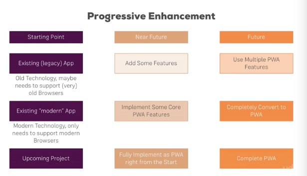

# PWA (Progressive Web Apps)
||| related to others

## ref links to check for updatedness of PWAs over all devices and services
- [caniuse](https://caniuse.com/#feat=web-app-manifest)
- [full docs for manifest.json](https://developer.mozilla.org/en-US/docs/Web/Manifest)
- [manifest.json intro by google](https://developers.google.com/web/fundamentals/web-app-manifest/)
- [install banners (chrome) (the important part that makes things accessible like a native app)](https://developers.google.com/web/fundamentals/app-install-banners/)

<!-- next slide -->

## kinda buzzwordy now
- perhaps use with [firebase?](https://howtofirebase.com/what-is-firebase-fcb8614ba442)

## doesn't work on all devices
- 100% on chrome 65
- super new on [safari](https://medium.com/awebdeveloper/progressive-web-apps-pwas-are-coming-to-a-safari-near-you-216812aba5a)
 [link2](https://medium.com/@firt/progressive-web-apps-on-ios-are-here-d00430dee3a7)
 	- support older webapp safari implementations with `<meta name="apple-mobile-web-app-capable" content="yes">`
 	- [and the rest through docs](https://developer.apple.com/library/content/documentation/AppleApplications/Reference/SafariWebContent/ConfiguringWebApplications/ConfiguringWebApplications.html)
 - if you are adding fallback options (for ios safari `apple-mobile-web-app-*` or for internet explorer) in html, you have to do it MANUALLY FOR ALL HTML FILES YOU USE.
 	- difference between new and old methods are
 		- new: add `manifest.json`, edit that file to setup the app
 		- old: add `<meta>` and `link` tags **inline** in html, copy paste them to all other htmls.

[comparison (android and ios)](https://medium.com/@firt/progressive-web-apps-on-ios-are-here-d00430dee3a7/#cafa)

<!-- next slide -->

## important things to know
- PWA is a set of features that together make a native-ish app experience
- not only responsive, but also with:
- it is "progressive", so i don't need to implement everything to call it PWA
	- 
- progressively enhance web applications to look and feel like native apps

<!-- next slide -->

## 3 main things
1. Be Reliable - fast and has offline functionality
2. Fast - respond quickly to user actions
3. Engaging - get the users back into the app (push notifications)

<!-- next slide -->

## couldn't you do the same thing with native mobile technologies?

<!-- next slide -->

why native apps
- push notifications bring users back
- home screne icons make access easy
- access to native device features like camera, gps, others
- possible to work offline

(what other things can be used to bring users back voluntarily?)

<!-- next slide -->

why not native apps
- multiple languages, multiple tech teams to maintain
- difficult to get user to install (so they rarely)

<!-- next slide -->

traditional web apps
- high reach, easy to access (no installation)

progressive web apps
- + access to device features, leverage OS speed ups
- also high reach, easy to access (no installation)

<!-- next slide -->

## core building blocks of PWAs

1. service workers 

> kinda like pasting your javascript code onto other people's PCs and being able to access their stuff
- supported in modern browsers
- basically a background process running js (a bit like your own little box of that previously `webapi`s have (for stuff like `setTimeout`))
- allows you to do **caching** / offline support (just ask the code to provide some offline version or offline interactivity)

examples:
- Background Sync
- Web Push Notifications

2. Application Manifest
- makes it installable on homescreens
- actually kinda like a settings file like `package.json`

3. Responsive Design
- looking good across devices

4. APIs
- Geolocation API
- Media API (Camera)

## SPAs vs PWAs
#### Single Page Applications (SPAs)
- a single html file, and JS is used to create and manipulate the DOM tree to build and rebuild stuff (which i think i really like)
- powered by Javascript
- highly reactive to user input
- only one html file sent to browser

#### Multi-page Applications
- the normal stuff

#### Progressive Web Apps (PWAs)
- is a CONCEPT encompassing a set of features
- doesn't really compare directly with SPAs or Multi-page. you can make an SPA a progresive web app.
- uses a lot of Javascript, but can even work without it
- doesn't need any frameworks to work
- aims to be highly Reactive, but mainly focuses on ***initial loading time***
- can work with multiple files too

## what is Progressive Enhancement
- it basically means we can progressively enhance our application
- slowly add bits onto existing (or plan from the beginning) applications to make it have better and better features

#### how does it fit into different types of projects?

## 1. manifest.json
- settings file for your app
- [more](1_web_app_manifest.md)

#### criteria for the 'add to homescreen' to work
[on chrome](https://developers.google.com/web/fundamentals/app-install-banners/)

## 2. service workers

- js files that are allowed to work on other people's (users) computers and mobile phones
- they (probably) live outside the Javascript Runtime (v8 chrome) and somewhere together with the WEBAPIs. in fact, they might just be working like a developer-customizable WEBAPI. 
- [the video understanding web apis and event loops](https://www.youtube.com/watch?v=8aGhZQkoFbQ) and [the awesome event loop ide 'loupe'](http://latentflip.com/loupe)
- [more](2_service_workers.md)
