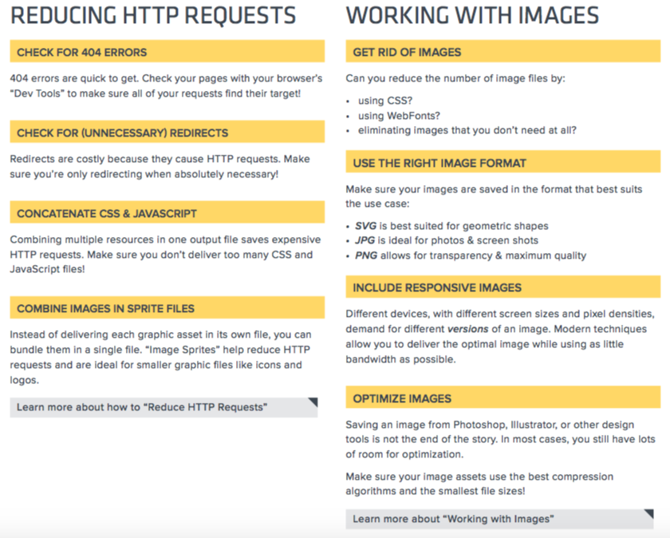
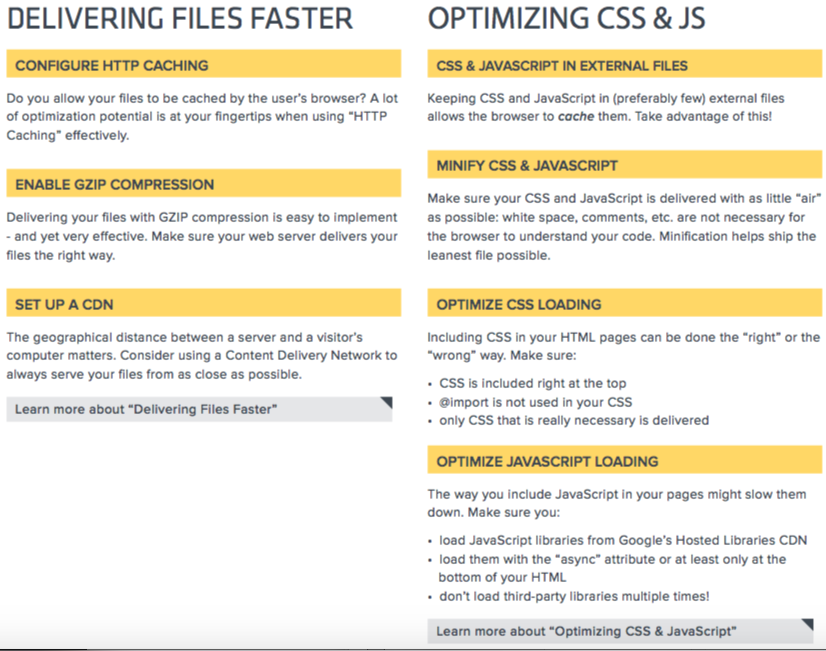

# WEB PERFORMANCE OPTIMIZATION
- end goal: user experience(UX) improvement
- streamlining is called Front End Optimization (FEO) or content optimization
- study how heavy webpages/dashboards optimize their content loading and loading order
- [apis to help do compression and stuff](https://labstack.com/a)
- [other apis](https://www.quora.com/Whats-the-best-website-screenshot-capture-API-i-e-an-API-that-converts-a-URL-into-an-image-screenshot-of-the-web-page)

[cheat sheet](https://drive.google.com/open?id=1nkz0RgqzYVFzZhf6RXwH9LufDOZoGQn-)
[ebook](https://drive.google.com/file/d/1Q4xFuPrxATBPFF6CEiWWeyXE67Jbzrah/view?usp=sharing)

## TODO: tutorial
- knowing the 'critical rendering path' (by google) https://www.udacity.com/course/website-performance-optimization--ud884
- [git tower tutorial](https://www.git-tower.com/learn/website-optimization)

## course - knowing the 'critical rendering path'
- https://www.udacity.com/course/website-performance-optimization--ud884

## key metrics
- https://www.keycdn.com/blog/website-performance-metrics/

## front end
increases
- visitor retention
- loyalty
- user satisfaction
	- users with slow internet connections
	- mobile users

## back end
lowers
- power consumption
- environmental impact

## topics
- browser/server cache
	- multi-layered cache
- image optimization
	- encryption (SSL) : can affect render time
- asynchronous communication with server side
- CDN (content distribution network)
	- proxy servers around the globe for efficient delivery
- code minification

## links
- https://www.keycdn.com/blog/website-performance-optimization/
- https://stackify.com/web-performance-optimization/
- https://apiumhub.com/tech-blog-barcelona/web-performance-optimization-techniques/
- https://www.dynatrace.com/news/blog/5-cant-miss-web-performance-optimization-basics/
- https://gist.github.com/wayspurrchen/b6fd4eb085edf54406b7

