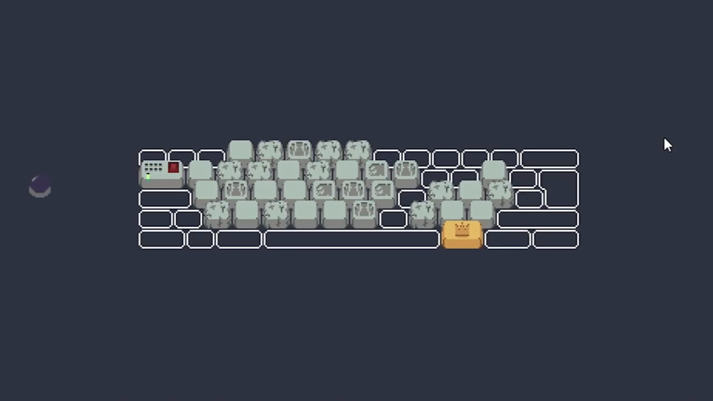
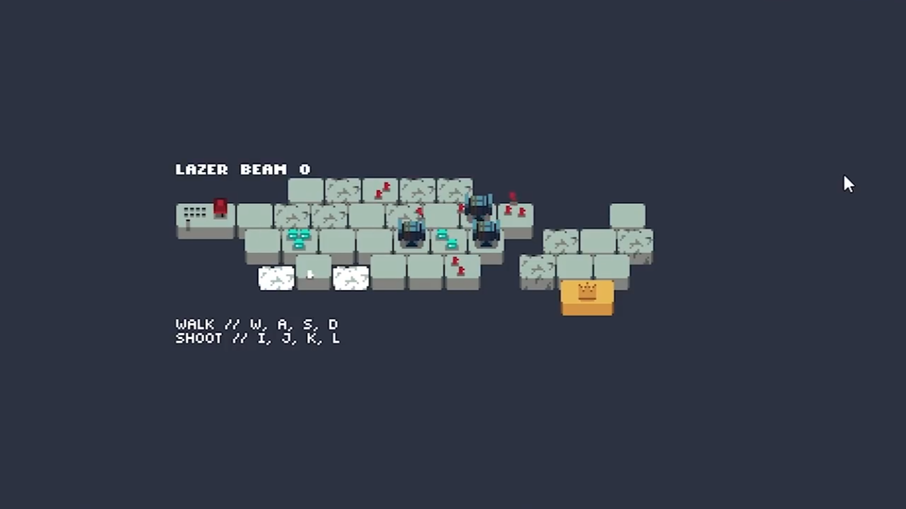
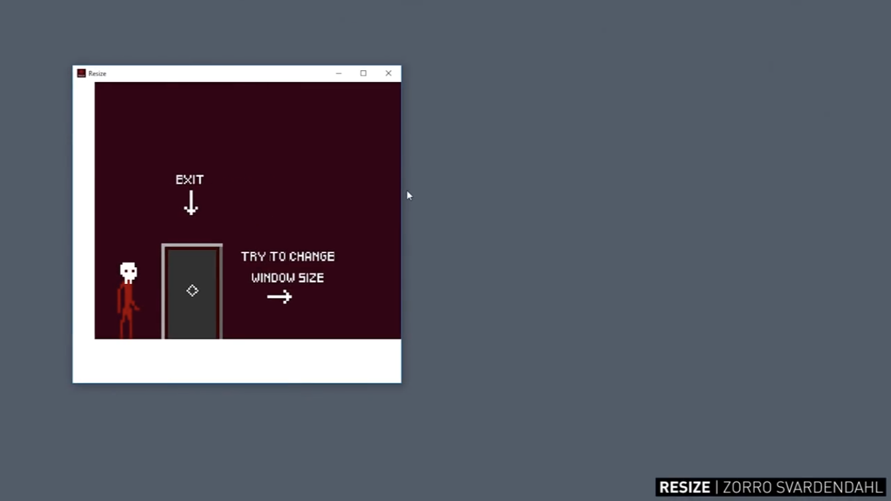
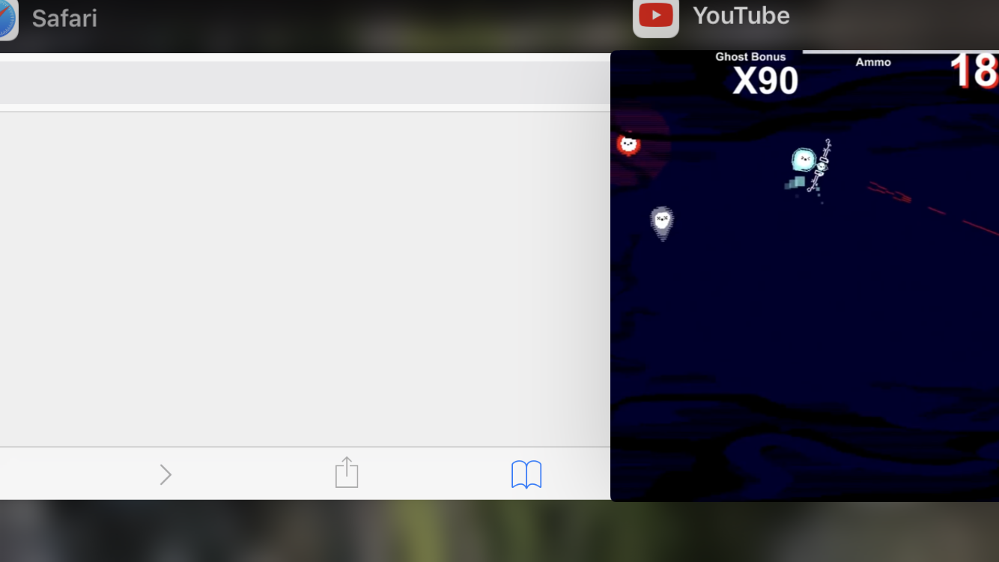
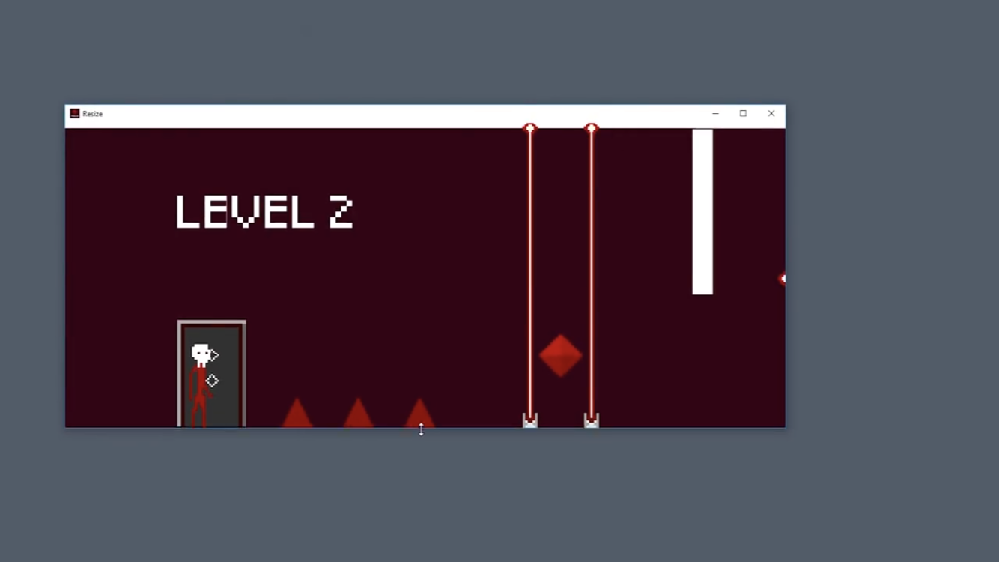
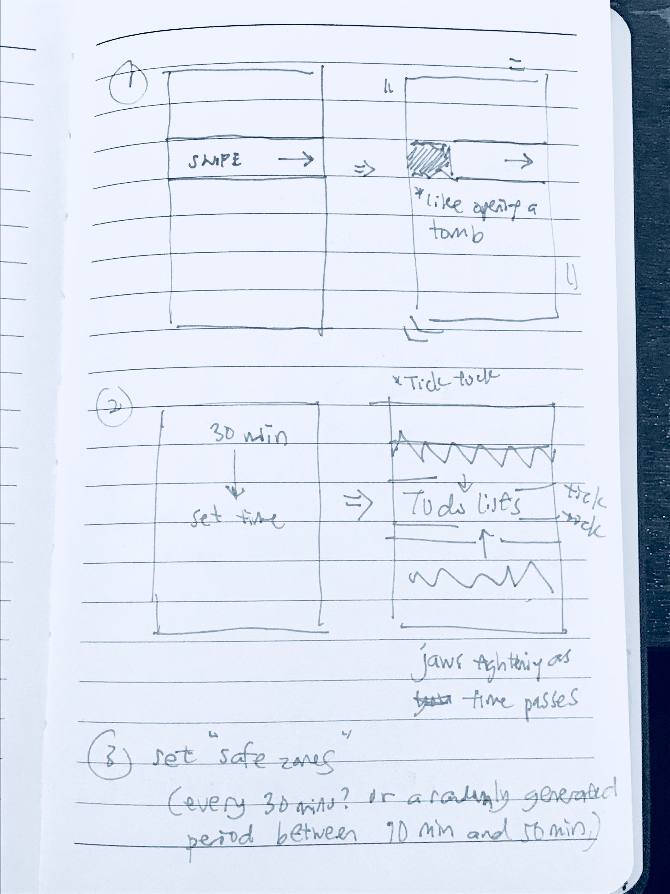

# Personal Apps
||| personal

## 0. react + e.which + js <-> css
### pitch
react to keyboard presses by changing css properties on screen and make them do something

- [use this as a base](https://github.com/developit/preact-todomvc/blob/master/src/app/item.js) (i have my own written version)

### handling e.which (to get keys)
- https://stackoverflow.com/questions/3050984/javascript-event-e-which
- http://forum.jquery.com/topic/eventwhich-code-list-just-for-help

### colors
- https://www.programmableweb.com/api/colourlovers

### superfancy (ai of course)
- https://deepai.org/api-docs/#introduction

### use brain.js to do some little NNs?

### inspiration

## 1. react (native?) + game design
### pitch
name: epic todolist!
what it does: game effects and reactions in a todolist. all actions have an epic feeling to it, from screneshake to flashes of colour (like slashing)

### description
you are an adventurer entering a cave with a band of warriors, and you've walked into a trap. he cave is actually the jaws of a dragon (or jaws of time XD)! to exit, you have to complete tasks on your todo list

### generating the todo list

#### general effects with interactive objecs
- like the css toggle, colourful, low input high output effects

#### adding an item
- EFFECT: every keypress has flashes of light or 

#### setting a timer
- drag down to set (not a lienar setting, but easing in-out-in)
- general time between 10 min and 50 mind (other times can be set, but they are toward the beginning or end of drag)
- EFFECT: sound effect like prison doors closing when you let go
- EFFECT: as you drag down, colours change and screenshakes

#### while not interacting with todo list
- little pixel warrior slashing at the jaws to no avail (animated)

#### checking done on a todo item
- performs an attack on the jaws
- EFFECT: colourful flashes on screen as a slash is performed
- racks up time saved as 'damage'
- provides interesting ways to do stuff with the time saved

#### notifications
- sets up a reminder for every task and breaktime

### inspiration
- [fancy toggle](https://codepen.io/panzerstadt/pen/YarQrp)

## 2. a 'what did i do on dd-mm?' app
- signs in to my gmail accounts (important)
- apple notes and 
- github and 
- google (google activity?)
- facebook (messenger esp)
- twitter (opt)
- instagram (opt)
- google maps location history
- google calendar
- youtube
- medium
- safari and chrome browser history

*use anomaly detection to detect different places i went to outside of my daily commute and work/home*

#### displays it in a short paragraph
#### also displays it as a list of 'achievements'

### answers to:
#### what did i do on 'dd-mm'
#### what did i do last week
#### what did i do last month

## holy crap! i better learn to encrypt this properly
